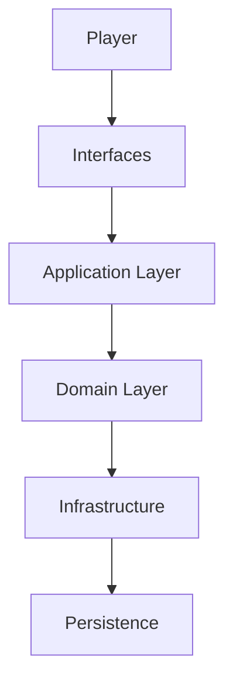
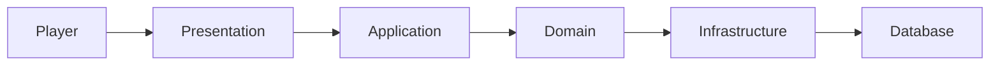

# OVERVIEW

# Visão Geral da Arquitetura

## LifeOS

**Versão:** 1.0

**Status:** Documento Oficial

---

# Objetivo

Este documento apresenta a visão arquitetural de alto nível do LifeOS.

Seu objetivo é permitir que qualquer desenvolvedor ou agente de Inteligência Artificial compreenda rapidamente como a plataforma está organizada, quais são seus principais módulos e como eles se relacionam.

Este documento não substitui os demais documentos arquiteturais.

Ele funciona como um mapa da arquitetura.

---

# Visão Geral

O LifeOS é uma plataforma modular para desenvolvimento humano.

Sua arquitetura foi projetada para atender aos seguintes objetivos:

- Independência entre módulos
- Evolução contínua
- Baixo acoplamento
- Alta coesão
- Escalabilidade
- Testabilidade
- Independência de tecnologia

O sistema foi concebido para que novas funcionalidades possam ser adicionadas sem necessidade de reestruturar os módulos existentes.

---

# Arquitetura Conceitual

```
                   LifeOS

                        │

        ┌───────────────┼───────────────┐

        │               │               │

    Produto        Arquitetura      Engenharia

        │               │               │

        ▼               ▼               ▼

Capabilities      Camadas         Implementação

        │               │               │

        ▼               ▼               ▼

 Módulos        Componentes      Código
```

---

# Visão Geral da Plataforma



---

# Arquitetura em Camadas

O LifeOS é organizado em cinco camadas principais.

```
Presentation

↓

Application

↓

Domain

↓

Infrastructure

↓

Persistence
```

Cada camada possui responsabilidades bem definidas.

---

# Presentation Layer

Responsável por toda interação com o usuário.

Exemplos:

- Streamlit
- API REST
- CLI
- Mobile (futuro)

Responsabilidades:

- Renderização
- Navegação
- Entrada de dados
- Exibição de resultados

Não contém regras de negócio.

---

# Application Layer

Responsável por coordenar casos de uso.

Contém:

- Use Cases
- Application Services
- Commands
- Queries
- DTOs
- Mappers

Responsabilidades:

- Orquestrar operações
- Controlar fluxo das funcionalidades
- Coordenar chamadas ao domínio

---

# Domain Layer

É o núcleo do LifeOS.

Representa o conhecimento do negócio.

Contém:

- Entities
- Value Objects
- Domain Services
- Policies
- Specifications
- Events
- Repository Interfaces

Nenhuma tecnologia deve ser conhecida pelo domínio.

---

# Infrastructure Layer

Implementa os recursos externos.

Exemplos:

- SQLAlchemy
- SQLite
- Logger
- Email
- Backup
- Configurações

Também implementa os contratos definidos pelo domínio.

---

# Persistence Layer

Responsável pelo armazenamento dos dados.

Inicialmente:

SQLite

Futuramente:

- PostgreSQL
- MySQL
- SQL Server

A camada superior nunca deve conhecer detalhes da persistência.

---

# Organização dos Módulos

O LifeOS é dividido em módulos independentes.


Cada módulo representa um domínio funcional.

---

# Módulos da Plataforma

## Authentication

Gerencia identidade e autenticação.

---

## Character

Representa a evolução do Player.

---

## Health

Indicadores biológicos.

---

## Workout

Treinos.

---

## Reading

Leitura.

---

## Therapy

Sessões terapêuticas.

---

## Habits

Hábitos.

---

## Gamification

Sistema de progressão.

---

## Analytics

Transformação de dados em conhecimento.

---

## AI Mentor

Recomendações inteligentes.

---

## Reports

Exportação de informações.

---

## Administration

Configurações e auditoria.

---

# Motores da Plataforma (Engines)

Além dos módulos de negócio, o LifeOS possui motores especializados.

```
Game Engine

Analytics Engine

AI Engine
```

Esses motores podem ser utilizados por diversos módulos simultaneamente.

---

# Fluxo Geral



---

# Fluxo de Evolução

```mermaid
flowchart LR

Registro

-->

Validação

-->

Persistência

-->

Game Engine

-->

Analytics

-->

AI

-->

Dashboard
```

Toda informação registrada percorre esse fluxo.

---

# Dependências

A direção das dependências é sempre de fora para dentro.

```
Presentation

↓

Application

↓

Domain

↓

Infrastructure

↓

Persistence
```

O domínio nunca depende das camadas externas.

---

# Comunicação entre Módulos

Os módulos comunicam-se através de:

- Services
- Use Cases
- Domain Events

Nunca através de acesso direto às implementações internas.

---

# Organização Física

A arquitetura lógica é refletida na estrutura de diretórios do projeto.

Cada camada possui sua própria organização.

Os detalhes serão apresentados em:

- `docs/02_ARCHITECTURE/06_FOLDER_STRUCTURE.md`

---

# Evolução da Plataforma

O LifeOS foi concebido para crescimento contínuo.

Novos módulos poderão ser adicionados.

Exemplos:

- Nutrition
- Finance
- Career
- Languages
- Relationships

Sem necessidade de alterar os módulos existentes.

---

# Escalabilidade

A arquitetura suporta evolução para:

- API pública
- Aplicativo Mobile
- Desktop
- Cloud
- Microserviços (quando necessário)

A estratégia inicial permanece um Monólito Modular.

---

# Decisões Arquiteturais

As principais decisões técnicas são:

- Clean Architecture
- Domain-Driven Design
- Modular Monolith
- Repository Pattern
- Service Layer
- Domain Events

Cada decisão será detalhada em documentos específicos.

---

# Relação com a Documentação

Este documento deve ser lido antes de:

- `docs/02_ARCHITECTURE/02_CLEAN_ARCHITECTURE.md`
- `docs/02_ARCHITECTURE/03_DDD.md`
- `docs/02_ARCHITECTURE/05_MODULAR_MONOLITH.md`
- `docs/03_DATABASE/DATABASE.md`
- `docs/04_BACKEND/BACKEND_GUIDE.md`

---

# Critérios de Aceite

Este documento será considerado concluído quando:

- A arquitetura geral estiver claramente representada.
- Todas as camadas estiverem descritas.
- Todos os módulos estiverem identificados.
- Os fluxos principais estiverem documentados.
- As regras de dependência estiverem explícitas.
- Os diagramas estiverem atualizados.

---

# Conclusão

O Overview representa a visão arquitetural de alto nível do LifeOS.

Ele fornece uma compreensão global da plataforma e serve como ponto de partida para toda a documentação técnica subsequente.

Todos os documentos arquiteturais complementam este Overview e detalham aspectos específicos da solução.
