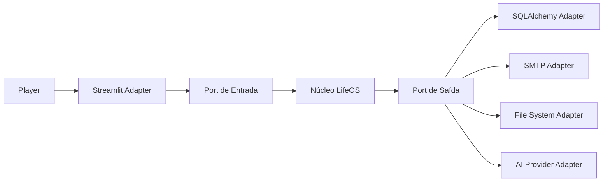
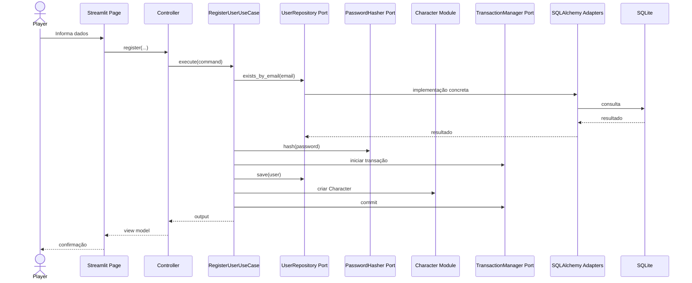
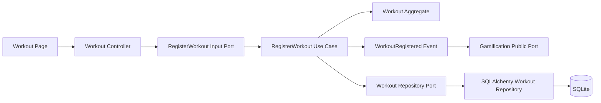

# HEXAGONAL ARCHITECTURE

## LifeOS

**Versão:** 1.0  
**Status:** Documento Oficial  
**Padrão Arquitetural:** Arquitetura Hexagonal — Ports and Adapters

---

# 1. Objetivo

Este documento define como os princípios da Arquitetura Hexagonal são aplicados no LifeOS.

Seu objetivo é garantir que o núcleo da aplicação permaneça independente de interfaces, bancos de dados, frameworks, serviços externos e detalhes de infraestrutura.

A arquitetura deve permitir que o mesmo domínio e os mesmos casos de uso sejam utilizados por diferentes mecanismos de entrada e saída, como:

- Streamlit;
- API REST;
- CLI;
- aplicação desktop;
- aplicativo mobile;
- banco SQLite;
- banco PostgreSQL;
- serviços de e-mail;
- sistemas de arquivos;
- provedores de Inteligência Artificial.

A regra fundamental é:

> O núcleo do LifeOS não deve conhecer os mecanismos externos utilizados para executá-lo.

---

# 2. Escopo

Este documento especifica:

- definição de núcleo da aplicação;
- Ports de entrada;
- Ports de saída;
- Adapters de entrada;
- Adapters de saída;
- regras de dependência;
- comunicação entre módulos;
- integração com Streamlit;
- integração com banco de dados;
- integração com serviços externos;
- testes baseados em contratos;
- organização física dos artefatos;
- padrões obrigatórios para agentes de IA.

Este documento complementa:

- `OVERVIEW.md`;
- `docs/02_ARCHITECTURE/02_CLEAN_ARCHITECTURE.md`;
- `docs/02_ARCHITECTURE/03_DDD.md`;
- `docs/02_ARCHITECTURE/05_MODULAR_MONOLITH.md`;
- `docs/02_ARCHITECTURE/06_FOLDER_STRUCTURE.md`.

---

# 3. Motivação

O LifeOS deve evoluir sem que seu domínio fique preso à tecnologia utilizada na primeira versão.

A versão inicial utiliza Streamlit, SQLAlchemy e SQLite. Esses componentes são escolhas de implementação, não elementos do domínio.

Sem uma fronteira explícita, regras de negócio tendem a depender de:

- funções do Streamlit;
- sessões do framework;
- modelos SQLAlchemy;
- conexões de banco;
- APIs externas;
- formatos de transporte;
- detalhes de autenticação da interface.

A Arquitetura Hexagonal evita esse acoplamento ao separar a aplicação em:

```text
Mundo Externo
     │
     ▼
Adapters de Entrada
     │
     ▼
Ports de Entrada
     │
     ▼
Núcleo da Aplicação
     │
     ▼
Ports de Saída
     │
     ▼
Adapters de Saída
     │
     ▼
Mundo Externo
```

---

# 4. Princípio Central

O núcleo define o que precisa ser feito.

Os adapters definem como isso é realizado.

Exemplo:

```text
Núcleo:

"Preciso persistir um Character."

Port de saída:

CharacterRepository

Adapter de saída:

SqlAlchemyCharacterRepository
```

O núcleo não conhece SQLAlchemy.

Outro exemplo:

```text
Núcleo:

"Preciso enviar um e-mail de redefinição de senha."

Port de saída:

EmailSender

Adapter de saída:

SmtpEmailSender
```

O núcleo não conhece SMTP.

---

# 5. Visão Conceitual



---

# 6. Núcleo da Aplicação

O núcleo da aplicação é composto por:

```text
Domain
+
Application
```

## Domain

Contém:

- Entities;
- Value Objects;
- Aggregates;
- Domain Services;
- Policies;
- Specifications;
- Domain Events;
- Repository Interfaces;
- regras de negócio.

## Application

Contém:

- Use Cases;
- Commands;
- Queries;
- DTOs;
- Application Services;
- Ports;
- Mappers;
- coordenação transacional.

O núcleo não pode depender de:

- Streamlit;
- SQLAlchemy;
- SQLite;
- Plotly;
- pandas;
- SMTP;
- APIs externas;
- sistema operacional;
- arquivos;
- variáveis de ambiente diretamente.

---

# 7. Ports

Ports são contratos que definem como o núcleo se comunica com o mundo externo.

Existem dois tipos:

```text
Ports de Entrada
Ports de Saída
```

---

# 8. Ports de Entrada

Ports de entrada definem operações que podem ser solicitadas ao LifeOS.

Eles representam as capacidades oferecidas pela aplicação.

Exemplos:

```text
RegisterUser
AuthenticateUser
RegisterWorkout
RegisterSleep
CompleteHabit
GrantExperience
GetCharacterSheet
GenerateDashboard
RequestPasswordReset
```

Um Port de entrada pode ser representado por:

- interface;
- protocolo;
- classe abstrata;
- Use Case público;
- Facade pública de módulo.

Exemplo:

```python
from typing import Protocol

from lifeos.modules.auth.application.commands.register_user_command import (
    RegisterUserCommand,
)
from lifeos.modules.auth.application.dto.register_user_output import (
    RegisterUserOutput,
)


class RegisterUserInputPort(Protocol):
    def execute(
        self,
        command: RegisterUserCommand,
    ) -> RegisterUserOutput:
        ...
```

---

# 9. Adapters de Entrada

Adapters de entrada recebem solicitações externas e as convertem para o formato esperado pelos Ports de entrada.

Exemplos:

- página Streamlit;
- Controller;
- endpoint FastAPI futuro;
- comando CLI;
- processo agendado;
- consumidor de evento;
- teste automatizado.

Fluxo:

```text
Player
  ↓
Streamlit Page
  ↓
Controller
  ↓
Command
  ↓
Input Port
  ↓
Use Case
```

---

# 10. Adapter de Entrada Streamlit

O Streamlit é um Adapter de entrada.

Ele não é a aplicação.

Ele apenas:

1. coleta dados;
2. executa validações visuais simples;
3. chama um Controller;
4. recebe uma resposta;
5. renderiza o resultado.

Exemplo:

```python
def render_register_page(controller: RegisterUserController) -> None:
    name = st.text_input("Nome")
    email = st.text_input("E-mail")
    password = st.text_input("Senha", type="password")
    confirmation = st.text_input("Confirmar senha", type="password")

    if st.button("Criar conta"):
        response = controller.register(
            name=name,
            email=email,
            password=password,
            password_confirmation=confirmation,
        )

        if response.success:
            st.success("Conta criada com sucesso.")
        else:
            st.error(response.message)
```

O Adapter Streamlit não deve:

- gerar hash;
- acessar Repository;
- abrir transação;
- criar Entity;
- calcular XP;
- executar SQL;
- conhecer modelos SQLAlchemy.

---

# 11. Controllers como Adapters de Entrada

Controllers adaptam dados externos para Commands e Queries.

Exemplo:

```python
class RegisterUserController:
    def __init__(self, use_case: RegisterUserInputPort) -> None:
        self._use_case = use_case

    def register(
        self,
        name: str,
        email: str,
        password: str,
        password_confirmation: str,
    ) -> RegisterUserViewModel:
        command = RegisterUserCommand(
            name=name,
            email=email,
            password=password,
            password_confirmation=password_confirmation,
        )

        output = self._use_case.execute(command)
        return RegisterUserPresenter.present(output)
```

Controllers não devem conter regras de negócio.

---

# 12. Ports de Saída

Ports de saída definem recursos externos necessários pelo núcleo.

Exemplos:

```text
UserRepository
CharacterRepository
WorkoutRepository
PasswordHasher
EmailSender
TokenGenerator
Clock
TransactionManager
EventPublisher
FileStorage
BackupStorage
AIProvider
```

O núcleo define esses contratos.

A Infrastructure fornece as implementações.

Exemplo:

```python
from typing import Protocol

from lifeos.modules.character.domain.entities.character import Character


class CharacterRepository(Protocol):
    def find_by_user_id(self, user_id: str) -> Character | None:
        ...

    def save(self, character: Character) -> None:
        ...
```

---

# 13. Adapters de Saída

Adapters de saída implementam Ports de saída.

Exemplos:

| Port | Adapter |
|---|---|
| `UserRepository` | `SqlAlchemyUserRepository` |
| `PasswordHasher` | `BcryptPasswordHasher` |
| `EmailSender` | `SmtpEmailSender` |
| `TokenGenerator` | `SecureTokenGenerator` |
| `Clock` | `SystemClock` |
| `FileStorage` | `LocalFileStorage` |
| `AIProvider` | `GeminiAIProvider` |
| `EventPublisher` | `InMemoryEventBus` |

---

# 14. Adapter de Persistência

A persistência é um Adapter de saída.

Fluxo:

```text
Use Case
  ↓
Repository Port
  ↓
SqlAlchemy Repository Adapter
  ↓
Persistence Mapper
  ↓
SQLAlchemy Model
  ↓
SQLite
```

Exemplo:

```python
class SqlAlchemyCharacterRepository(CharacterRepository):
    def __init__(self, session: Session) -> None:
        self._session = session

    def find_by_user_id(self, user_id: str) -> Character | None:
        model = (
            self._session.query(CharacterModel)
            .filter(CharacterModel.user_id == user_id)
            .one_or_none()
        )

        if model is None:
            return None

        return CharacterPersistenceMapper.to_domain(model)

    def save(self, character: Character) -> None:
        model = CharacterPersistenceMapper.to_model(character)
        self._session.merge(model)
```

A Entity de domínio não deve conhecer o modelo SQLAlchemy.

---

# 15. Adapter de E-mail

O fluxo de recuperação de senha utiliza um Port de saída.

```python
from typing import Protocol


class EmailSender(Protocol):
    def send_password_reset(
        self,
        recipient: str,
        reset_token: str,
        expires_in_minutes: int,
    ) -> None:
        ...
```

Implementação:

```python
class SmtpEmailSender(EmailSender):
    def send_password_reset(
        self,
        recipient: str,
        reset_token: str,
        expires_in_minutes: int,
    ) -> None:
        ...
```

Durante testes:

```python
class InMemoryEmailSender(EmailSender):
    def __init__(self) -> None:
        self.messages: list[dict[str, object]] = []

    def send_password_reset(
        self,
        recipient: str,
        reset_token: str,
        expires_in_minutes: int,
    ) -> None:
        self.messages.append(
            {
                "recipient": recipient,
                "reset_token": reset_token,
                "expires_in_minutes": expires_in_minutes,
            }
        )
```

---

# 16. Adapter de Inteligência Artificial

O AI Mentor deve depender de um Port abstrato.

```python
from typing import Protocol


class AIProvider(Protocol):
    def generate_recommendation(
        self,
        context: str,
    ) -> str:
        ...
```

Possíveis Adapters:

```text
GeminiAIProvider
OpenAIProvider
LocalLLMProvider
DisabledAIProvider
```

A troca de provedor não deve alterar os casos de uso.

---

# 17. Adapter de Relógio

Regras dependentes de tempo devem utilizar um Port.

```python
from datetime import datetime
from typing import Protocol


class Clock(Protocol):
    def now(self) -> datetime:
        ...
```

Produção:

```python
class SystemClock(Clock):
    def now(self) -> datetime:
        return datetime.now()
```

Teste:

```python
class FixedClock(Clock):
    def __init__(self, fixed_datetime: datetime) -> None:
        self._fixed_datetime = fixed_datetime

    def now(self) -> datetime:
        return self._fixed_datetime
```

Isso evita testes instáveis.

---

# 18. Adapter de Transação

Casos de uso transacionais devem depender de um Port.

```python
from typing import Protocol


class TransactionManager(Protocol):
    def __enter__(self) -> "TransactionManager":
        ...

    def __exit__(
        self,
        exc_type: object,
        exc_value: object,
        traceback: object,
    ) -> None:
        ...

    def commit(self) -> None:
        ...

    def rollback(self) -> None:
        ...
```

O Use Case não deve controlar diretamente uma Session SQLAlchemy.

---

# 19. Fluxo Completo de Cadastro



---

# 20. Fluxo Completo de Registro de Treino



---

# 21. Aplicação aos Módulos

Cada módulo deve possuir sua própria fronteira hexagonal.

Exemplo:

```text
character/
├── application/
│   ├── ports/
│   ├── use_cases/
│   └── dto/
├── domain/
│   ├── entities/
│   └── repositories/
├── infrastructure/
│   ├── adapters/
│   └── repositories/
├── presentation/
│   └── controllers/
└── public/
```

---

# 22. Fronteira Pública do Módulo

A API pública de um módulo funciona como Port para outros módulos.

Exemplo:

```python
class CharacterModuleFacade:
    def create_initial_character(
        self,
        user_id: str,
        player_name: str,
    ) -> CharacterSummary:
        ...

    def grant_experience(
        self,
        request: ExperienceGrantRequest,
    ) -> CharacterProgressionResult:
        ...
```

Outro módulo não pode acessar:

```text
character/domain/entities/
character/infrastructure/repositories/
character/application/internal_services/
```

---

# 23. Comunicação entre Módulos

A comunicação entre módulos pode ocorrer de duas formas.

## Comunicação síncrona

Usar Facades ou contratos públicos.

Exemplo:

```text
Auth Module
  ↓
CharacterModuleFacade.create_initial_character(...)
```

## Comunicação assíncrona interna

Usar eventos públicos.

Exemplo:

```text
WorkoutRegistered
  ↓
Game Module
  ↓
ExperienceGranted
  ↓
Character Module
```

---

# 24. Ports Síncronos e Eventos

Utilizar chamada síncrona quando:

- o resultado for necessário para concluir o caso de uso;
- a consistência imediata for obrigatória;
- a operação fizer parte da mesma transação.

Utilizar evento quando:

- o consumidor não precisar responder imediatamente;
- múltiplos módulos puderem reagir;
- o emissor não precisar conhecer consumidores;
- consistência eventual for aceitável.

---

# 25. Regras de Dependência

## Permitido

```text
Adapter de Entrada → Port de Entrada
Use Case → Domain
Use Case → Port de Saída
Adapter de Saída → Port de Saída
Infrastructure → Domain
Presentation → Application
```

## Proibido

```text
Domain → Adapter
Domain → Streamlit
Domain → SQLAlchemy
Use Case → SQLite
Use Case → SMTP
Controller → Repository concreto
Page → Session SQLAlchemy
Module A → internals do Module B
```

---

# 26. Composition Root

As dependências concretas devem ser ligadas no Composition Root.

Exemplo:

```python
def build_register_user_controller() -> RegisterUserController:
    session_factory = SqlAlchemySessionFactory()
    user_repository = SqlAlchemyUserRepository(session_factory)
    character_facade = build_character_module_facade()
    password_hasher = BcryptPasswordHasher()
    transaction_manager = SqlAlchemyTransactionManager(session_factory)

    use_case = RegisterUserUseCase(
        user_repository=user_repository,
        character_facade=character_facade,
        password_hasher=password_hasher,
        transaction_manager=transaction_manager,
    )

    return RegisterUserController(use_case)
```

Nenhum Use Case deve instanciar seu próprio Adapter.

---

# 27. Dependency Injection

A injeção de dependência deve ocorrer por construtor.

Exemplo:

```python
class RegisterUserUseCase:
    def __init__(
        self,
        user_repository: UserRepository,
        password_hasher: PasswordHasher,
        character_facade: CharacterModuleFacade,
        transaction_manager: TransactionManager,
    ) -> None:
        self._user_repository = user_repository
        self._password_hasher = password_hasher
        self._character_facade = character_facade
        self._transaction_manager = transaction_manager
```

Evitar:

- Service Locator;
- estado global;
- imports tardios para contornar ciclos;
- instanciação concreta dentro de casos de uso.

---

# 28. Tratamento de Erros

O núcleo deve lançar erros de domínio ou aplicação.

Adapters devem traduzi-los para a linguagem externa apropriada.

Exemplo:

```text
Domain Error
EmailAlreadyRegisteredError
        ↓
Controller
        ↓
RegisterUserErrorViewModel
        ↓
Streamlit
"E-mail já cadastrado."
```

A página não deve interpretar detalhes técnicos de banco.

---

# 29. Validação por Fronteira

Cada fronteira possui um tipo de validação.

## Adapter de Entrada

Valida:

- campo ausente;
- formato básico;
- tipo;
- conversão;
- limite visual.

## Application

Valida:

- pré-condições do caso de uso;
- permissão;
- existência de recursos;
- coordenação do fluxo.

## Domain

Valida:

- invariantes;
- regras de negócio;
- consistência interna.

## Adapter de Saída

Valida:

- integridade técnica;
- serialização;
- disponibilidade do recurso externo;
- conversão de modelos.

---

# 30. DTOs e Contratos

Adapters não devem transportar Entities para o exterior.

Utilizar:

- Commands;
- Query Objects;
- Input DTOs;
- Output DTOs;
- ViewModels;
- Public Contracts.

Fluxo:

```text
External Input
  ↓
Input DTO / Command
  ↓
Use Case
  ↓
Domain Entity
  ↓
Output DTO
  ↓
ViewModel
  ↓
External Output
```

---

# 31. Segurança nas Fronteiras

Autenticação e autorização devem ser aplicadas nas fronteiras apropriadas.

## Adapter de Entrada

- verifica presença da sessão;
- obtém identidade autenticada;
- bloqueia rota pública ou privada conforme configuração.

## Application

- valida se o ator pode executar o caso de uso;
- garante isolamento multi-tenant;
- propaga `user_id` obrigatório.

## Repository Adapter

- aplica filtro de tenant em toda consulta operacional;
- nunca retorna dados de outro Player.

Nenhum `user_id` recebido diretamente de formulário deve substituir a identidade autenticada.

---

# 32. Multi-Tenant

O `CurrentUserProvider` é um Port de entrada ou contexto da aplicação.

Exemplo:

```python
from typing import Protocol


class CurrentUserProvider(Protocol):
    def get_current_user_id(self) -> str:
        ...
```

Adapter Streamlit:

```python
class StreamlitCurrentUserProvider(CurrentUserProvider):
    def get_current_user_id(self) -> str:
        return str(st.session_state["user_id"])
```

Casos de uso não devem importar `streamlit.session_state`.

---

# 33. Testes Unitários

Use Cases devem ser testados com Adapters falsos ou em memória.

Exemplo:

```python
def test_register_user_creates_account_and_character() -> None:
    user_repository = InMemoryUserRepository()
    password_hasher = FakePasswordHasher()
    character_facade = FakeCharacterModuleFacade()
    transaction_manager = FakeTransactionManager()

    use_case = RegisterUserUseCase(
        user_repository=user_repository,
        password_hasher=password_hasher,
        character_facade=character_facade,
        transaction_manager=transaction_manager,
    )

    result = use_case.execute(
        RegisterUserCommand(
            name="Player",
            email="player@example.com",
            password="safe-password",
            password_confirmation="safe-password",
        )
    )

    assert result.user_id is not None
    assert character_facade.created_for_user_id == result.user_id
```

Não utilizar banco real em teste unitário.

---

# 34. Testes de Contrato

Todo Adapter de saída relevante deve respeitar o mesmo contrato.

Exemplo:

```text
CharacterRepositoryContract
├── InMemoryCharacterRepository
├── SqlAlchemyCharacterRepository
└── FuturePostgresCharacterRepository
```

O mesmo conjunto de testes deve validar todas as implementações.

---

# 35. Testes de Integração

Devem validar:

- Adapter SQLAlchemy;
- mapeamento ORM;
- transações;
- envio de e-mail simulado;
- Event Bus;
- persistência multi-tenant.

Esses testes podem utilizar um banco temporário.

---

# 36. Testes End-to-End

Validam a integração entre:

```text
Adapter de Entrada
+
Núcleo
+
Adapters de Saída
```

Exemplo:

```text
Cadastro
→ criação do usuário
→ criação do Character
→ início da sessão
→ exibição do Dashboard
```

---

# 37. Substituição de Adapters

A arquitetura deve permitir substituições como:

```text
Streamlit → FastAPI
SQLite → PostgreSQL
SMTP → Serviço transacional
Gemini → Modelo local
Local File Storage → Cloud Storage
InMemory Event Bus → Broker de mensagens
```

Sem modificar as regras do domínio.

---

# 38. Adapters Iniciais Oficiais

## Entrada

- `StreamlitRegisterUserAdapter`;
- `StreamlitLoginAdapter`;
- `StreamlitCharacterDashboardAdapter`;
- `StreamlitWorkoutAdapter`;
- `StreamlitSleepAdapter`;
- `StreamlitReadingAdapter`;
- `StreamlitTherapyAdapter`;
- `StreamlitHabitsAdapter`;
- `ScheduledJobAdapter`, quando necessário.

## Saída

- `SqlAlchemyUserRepository`;
- `SqlAlchemyCharacterRepository`;
- `SqlAlchemyWorkoutRepository`;
- `BcryptPasswordHasher`;
- `SecureTokenGenerator`;
- `SmtpEmailSender`;
- `LocalFileStorage`;
- `InMemoryEventBus`;
- `SystemClock`;
- `SqlAlchemyTransactionManager`.

---

# 39. Anti-patterns

São proibidos:

## Framework no domínio

```python
import streamlit as st
```

dentro de:

```text
domain/
application/
```

## ORM como Entity

```python
class Character(Base):
    ...
```

utilizado diretamente como modelo de domínio.

## Repository concreto no Use Case

```python
self.repository = SqlAlchemyCharacterRepository()
```

## Acesso direto ao banco pela interface

```python
session.query(CharacterModel)
```

em página Streamlit.

## Serviço externo instanciado diretamente

```python
smtp = SMTP(...)
```

dentro do Use Case.

## Retorno de Entity para a UI

```python
return character
```

sem DTO, Presenter ou ViewModel.

## Dependência interna entre módulos

```python
from lifeos.modules.game.domain.entities.quest import Quest
```

dentro de outro módulo.

---

# 40. Organização Física

Aplicação às pastas oficiais:

```text
module/
├── application/
│   ├── ports/
│   ├── use_cases/
│   ├── commands/
│   ├── queries/
│   └── dto/
├── domain/
│   ├── entities/
│   ├── repositories/
│   └── services/
├── infrastructure/
│   ├── adapters/
│   ├── repositories/
│   └── models/
├── presentation/
│   ├── controllers/
│   └── presenters/
└── public/
    ├── facade.py
    ├── contracts.py
    └── events.py
```

---

# 41. Como o Gemini deve utilizar este documento

Antes de implementar qualquer integração, o agente deve responder:

1. Qual é o núcleo da funcionalidade?
2. Qual Port de entrada será utilizado?
3. Qual Adapter de entrada fará a chamada?
4. Quais Ports de saída são necessários?
5. Quais Adapters concretos implementarão esses Ports?
6. Onde as dependências serão compostas?
7. Como os Adapters serão substituídos nos testes?
8. Existe acesso indevido a framework ou infraestrutura?

O agente deve rejeitar implementações que acoplem o núcleo a mecanismos externos.

---

# 42. Checklist de Implementação

Antes de concluir uma funcionalidade:

- [ ] O Use Case pode ser executado sem Streamlit.
- [ ] O domínio pode ser testado sem banco.
- [ ] Os recursos externos possuem Ports.
- [ ] Os Adapters implementam contratos explícitos.
- [ ] O Use Case não instancia implementações concretas.
- [ ] A Composition Root conecta as dependências.
- [ ] A UI recebe somente DTOs ou ViewModels.
- [ ] Nenhum módulo acessa internals de outro módulo.
- [ ] O `user_id` autenticado é aplicado no fluxo multi-tenant.
- [ ] Existem testes unitários com Fakes.
- [ ] Existem testes de contrato para Adapters críticos.

---

# 43. Critérios de Aceite

Este documento será considerado atendido quando:

- o núcleo não depender de frameworks;
- todos os recursos externos forem representados por Ports;
- todas as integrações possuírem Adapters;
- a interface Streamlit atuar somente como Adapter de entrada;
- o banco atuar somente como Adapter de saída;
- os módulos se comunicarem apenas por APIs públicas ou eventos;
- a injeção de dependência ocorrer no Composition Root;
- os casos de uso forem testáveis com implementações em memória;
- adapters concretos puderem ser substituídos sem alterar o domínio;
- testes arquiteturais detectarem violações de fronteira.

---

# 44. Definition of Done

Uma implementação só estará concluída quando:

- [ ] Ports estiverem definidos no núcleo.
- [ ] Adapters concretos estiverem fora do núcleo.
- [ ] As dependências apontarem para dentro.
- [ ] O Use Case estiver desacoplado da tecnologia.
- [ ] O Controller apenas adaptar entrada e saída.
- [ ] O Repository concreto estiver na Infrastructure.
- [ ] Os testes utilizarem Fakes quando apropriado.
- [ ] Os contratos públicos dos módulos forem respeitados.
- [ ] A documentação correspondente estiver atualizada.

---

# 45. Declaração Final

A Arquitetura Hexagonal garante que o LifeOS seja definido por seu domínio e por suas capacidades, não pelas tecnologias utilizadas para executá-lo.

Streamlit, SQLAlchemy, SQLite, serviços de e-mail e provedores de IA são mecanismos substituíveis.

As regras de evolução humana, Character, XP, hábitos, saúde, Analytics e mentoria representam o núcleo permanente da plataforma.

Toda implementação deve preservar essa separação.
