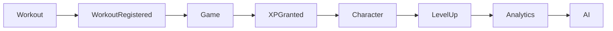

# MODULAR MONOLITH

## LifeOS

**Versão:** 1.0

**Status:** Documento Oficial

**Arquitetura Base:** Modular Monolith

---

# Objetivo

Este documento define a organização modular oficial do LifeOS.

O objetivo é permitir que o sistema cresça continuamente sem perder organização, coesão e manutenibilidade.

Cada módulo representa um domínio de negócio independente e encapsulado.

Os módulos comunicam-se apenas através de contratos bem definidos.

---

# Motivação

O LifeOS foi concebido para crescer durante muitos anos.

Novos módulos serão adicionados constantemente.

A arquitetura Modular Monolith permite:

- isolamento lógico dos domínios;
- baixo acoplamento;
- alta coesão;
- facilidade de testes;
- evolução incremental;
- futura migração para microserviços, se necessário.

O sistema permanecerá inicialmente como um único processo de execução.

A modularização é lógica e estrutural.

---

# Objetivos Arquiteturais

A arquitetura modular deverá garantir:

- independência entre módulos;
- isolamento das regras de negócio;
- comunicação controlada;
- ausência de dependências circulares;
- alta reutilização;
- simplicidade operacional.

---

# Conceitos

## Módulo

Um módulo representa um domínio funcional completo.

Cada módulo possui:

- responsabilidades próprias;
- entidades;
- casos de uso;
- serviços;
- eventos;
- persistência.

---

# Estrutura Geral

```text
LifeOS

├── AUTH
├── CHAR
├── HEALTH
├── WORK
├── READ
├── THER
├── HAB
├── GAME
├── DASH
├── ANLT
├── AI
├── REPORT
└── ADMIN
```

Cada módulo é autocontido.

---

# Organização Física

```text
src/

modules/

    auth/

    character/

    health/

    workout/

    reading/

    therapy/

    habits/

    game/

    dashboard/

    analytics/

    ai/

    reports/

    admin/
```

Cada pasta representa um módulo completo.

---

# Estrutura Interna de um Módulo

Exemplo:

```text
modules/

character/

    application/

    domain/

    infrastructure/

    presentation/

    tests/
```

Cada módulo implementa sua própria Clean Architecture.

---

# Organização Interna

```text
character/

application/

domain/

infrastructure/

presentation/

tests/
```

O módulo é completamente responsável por seu domínio.

---

# Exemplo Completo

```text
modules/

character/

    application/

        use_cases/

        dto/

        services/

        mappers/

    domain/

        entities/

        value_objects/

        repositories/

        services/

        events/

        policies/

        specifications/

    infrastructure/

        repositories/

        persistence/

    presentation/

        pages/

        components/

    tests/

        unit/

        integration/
```

---

# Comunicação Entre Módulos

Módulos nunca acessam diretamente classes internas de outros módulos.

A comunicação ocorre apenas através de:

- Interfaces
- Use Cases
- Domain Events

Nunca por acesso direto às Entities.

---

# APIs Públicas

Cada módulo deverá possuir uma API pública.

Exemplo:

Character Module

```python
CharacterService

CharacterQueryService
```

Internamente o módulo pode possuir dezenas de classes.

Externamente apenas contratos públicos.

---

# APIs Privadas

Toda classe interna é privada ao módulo.

Exemplo:

CharacterFactory

CharacterPolicy

CharacterRepositoryImpl

Nunca poderão ser utilizadas por outro módulo.

---

# Eventos Públicos

Cada módulo poderá publicar eventos.

Exemplo:

CharacterCreated

XPGranted

WorkoutRegistered

AchievementUnlocked

Os módulos consumidores não conhecem a implementação do módulo emissor.

---

# Dependências Permitidas

```text
AUTH

↓

CHAR

↓

GAME

↓

HEALTH

↓

WORK

↓

READ

↓

THER

↓

HAB

↓

ANLT

↓

AI

↓

DASH

↓

REPORT
```

A direção é sempre única.

---

# Dependências Proibidas

Nunca:

Analytics

↓

CharacterRepository

Diretamente.

Analytics deve consumir serviços públicos.

---

Nunca:

Workout

↓

SleepEntity

Diretamente.

---

Nunca:

Presentation

↓

SQLite

---

Nunca:

Character

↓

Workout Infrastructure

---

# Módulo Authentication

Responsável por:

- Usuários
- Sessões
- Autenticação
- Autorização

API Pública

```text
AuthService

CurrentUserProvider
```

---

# Módulo Character

Responsável por:

- Character
- Atributos
- Níveis
- Perfil

API Pública

```text
CharacterService

CharacterQueryService
```

---

# Módulo Game

Responsável por:

- XP
- Quests
- Rewards
- Skills
- Achievements
- Classes

API Pública

```text
GamificationService

QuestService

AchievementService
```

---

# Módulo Analytics

Responsável por:

- KPIs
- Correlações
- Tendências
- Indicadores

API Pública

```text
AnalyticsService
```

---

# Módulo AI

Responsável por:

- Recomendações
- Coach
- Missões
- Alertas

API Pública

```text
AIMentorService
```

---

# Shared Kernel

O LifeOS utilizará um Shared Kernel mínimo.

Ele conterá apenas:

- Result
- Errors
- Exceptions
- BaseEntity
- BaseRepository
- ValueObject
- DomainEvent
- Pagination
- Identifiers

Nunca colocar regras de negócio no Shared Kernel.

---

# Cross Cutting Concerns

Serviços compartilhados:

- Logging
- Configuração
- Observabilidade
- Cache
- Segurança

Devem permanecer fora dos módulos.

---

# Domain Events

Sempre que possível, módulos comunicarão através de eventos.

Exemplo

Workout

↓

WorkoutRegistered

↓

Game

↓

Grant XP

↓

Character

↓

Update Level

↓

Analytics

↓

Recalculate KPIs

↓

AI

↓

Generate Recommendation

Tudo desacoplado.

---

# Fluxo de Comunicação



---

# Evolução para Microserviços

Caso futuramente seja necessário dividir a aplicação:

Cada módulo poderá ser extraído como um microserviço.

Como as fronteiras já estarão bem definidas, essa migração exigirá alterações mínimas.

A arquitetura atual prioriza simplicidade operacional sem impedir evolução futura.

---

# Anti-patterns

Nunca:

✘ Módulo acessando banco de outro módulo.

✘ Módulo reutilizando Entity de outro módulo.

✘ Dependências circulares.

✘ SQL compartilhado.

✘ Services gigantes.

✘ Shared Kernel contendo regras.

---

# Como um Agente de IA deve utilizar este documento

Antes de implementar qualquer funcionalidade:

1. Identificar o módulo correto.
2. Implementar apenas dentro desse módulo.
3. Expor apenas contratos públicos.
4. Não acessar classes privadas de outro módulo.
5. Utilizar eventos para comunicação sempre que apropriado.
6. Respeitar as dependências definidas.
7. Atualizar a documentação caso um novo módulo seja criado.

---

# Critérios de Aceite

Este documento será considerado concluído quando:

- Todos os módulos estiverem definidos.
- Todas as fronteiras estiverem documentadas.
- Todas as APIs públicas estiverem identificadas.
- Todas as dependências permitidas estiverem descritas.
- As regras de comunicação estiverem documentadas.
- O fluxo de eventos estiver definido.

---

# Referências

- Modular Monolith – Simon Brown
- Domain-Driven Design – Eric Evans
- Clean Architecture – Robert C. Martin
- Building Evolutionary Architectures – Neal Ford