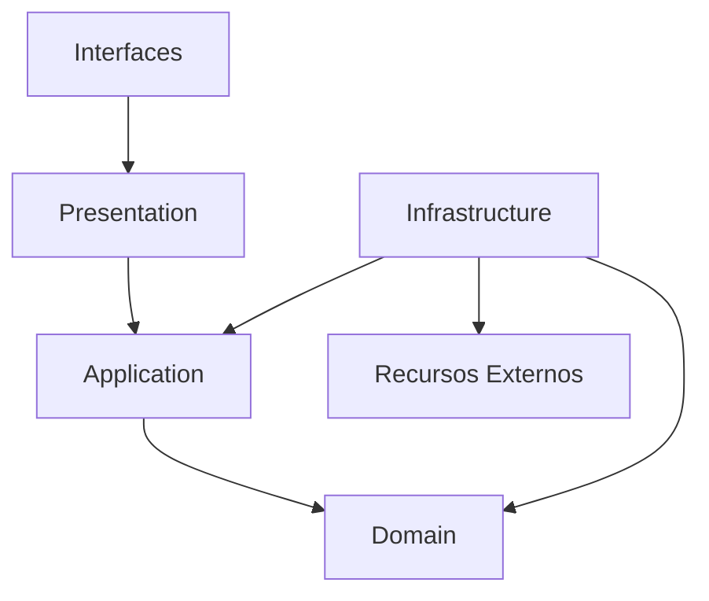
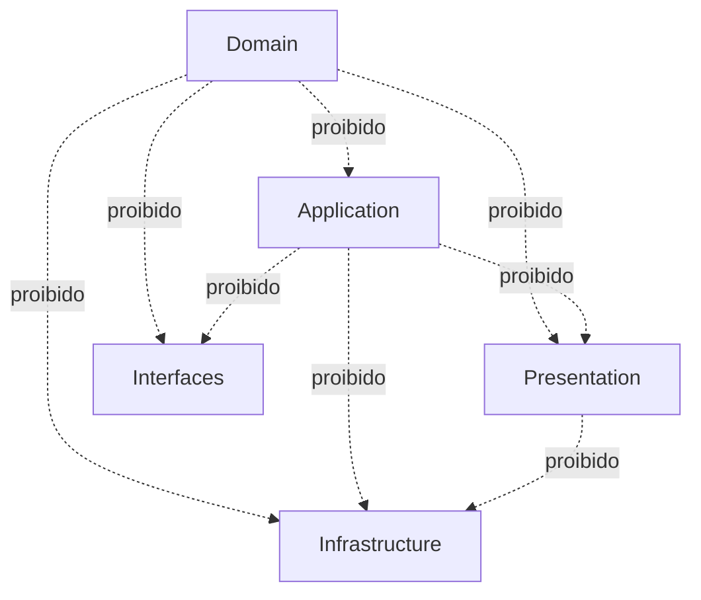

# DEPENDENCY RULES

## LifeOS

**Versão:** 1.0  
**Status:** Documento Oficial  
**Documento:** Regras Oficiais de Dependência  
**Arquiteturas Relacionadas:** Clean Architecture, Arquitetura Hexagonal, DDD e Monólito Modular

---

# 1. Objetivo

Este documento define as regras oficiais de dependência do LifeOS.

Seu objetivo é garantir que:

- as camadas permaneçam desacopladas;
- os módulos preservem suas fronteiras;
- o domínio continue independente de frameworks;
- a interface não acesse diretamente infraestrutura;
- dependências circulares sejam evitadas;
- a arquitetura permaneça verificável por testes automatizados;
- desenvolvedores e agentes de IA saibam exatamente quem pode depender de quem.

Toda implementação deve respeitar estas regras.

Uma dependência que viole este documento deve ser considerada um defeito arquitetural.

---

# 2. Escopo

Este documento cobre:

- dependências entre camadas;
- dependências entre módulos;
- dependências permitidas;
- dependências proibidas;
- regras de imports;
- regras de contratos públicos;
- regras de eventos;
- regras para o Shared Kernel;
- regras para infraestrutura compartilhada;
- regras para interfaces;
- regras para testes;
- prevenção de ciclos;
- validação arquitetural automatizada.

Este documento complementa:

- `OVERVIEW.md`;
- `docs/02_ARCHITECTURE/02_CLEAN_ARCHITECTURE.md`;
- `docs/02_ARCHITECTURE/03_DDD.md`;
- `docs/02_ARCHITECTURE/05_MODULAR_MONOLITH.md`;
- `docs/02_ARCHITECTURE/06_FOLDER_STRUCTURE.md`;
- `docs/02_ARCHITECTURE/04_HEXAGONAL.md`.

---

# 3. Princípio Fundamental

A direção das dependências deve apontar para o núcleo da aplicação.

```text
Interfaces
    ↓
Presentation
    ↓
Application
    ↓
Domain
```

A Infrastructure implementa contratos definidos pelo núcleo.

```text
Infrastructure
    ↓
Domain / Application Ports
```

O Domain não depende de nenhuma camada externa.

---

# 4. Regra de Dependência da Clean Architecture

A regra principal é:

> Uma camada interna nunca pode depender de uma camada externa.

Ordem de estabilidade:

```text
Domain
↑
Application
↑
Presentation
↑
Interfaces
```

Infrastructure permanece externa, mas depende de contratos internos:

```text
Infrastructure
→ Domain
Infrastructure
→ Application Ports
```

---

# 5. Matriz Geral de Dependências entre Camadas

| Origem | Domain | Application | Infrastructure | Presentation | Interfaces |
|---|---:|---:|---:|---:|---:|
| Domain | Permitido | Proibido | Proibido | Proibido | Proibido |
| Application | Permitido | Permitido | Proibido | Proibido | Proibido |
| Infrastructure | Permitido | Permitido apenas para Ports | Permitido | Proibido | Proibido |
| Presentation | Proibido diretamente, exceto tipos públicos aprovados | Permitido | Proibido | Permitido | Proibido |
| Interfaces | Proibido | Permitido via Controllers e Facades | Proibido | Permitido | Permitido |

---

# 6. Dependências do Domain

## 6.1 Permitido

O Domain pode depender de:

- biblioteca padrão do Python;
- tipos do próprio módulo;
- elementos mínimos do Shared Kernel;
- abstrações puras;
- Value Objects;
- Domain Events;
- Repository Interfaces;
- Policies;
- Specifications.

Exemplo permitido:

```python
from dataclasses import dataclass

from lifeos.modules.character.domain.value_objects.experience_points import (
    ExperiencePoints,
)
```

---

## 6.2 Proibido

O Domain não pode depender de:

- Streamlit;
- FastAPI;
- SQLAlchemy;
- SQLite;
- pandas;
- Plotly;
- SMTP;
- bibliotecas de interface;
- arquivos de configuração;
- variáveis de ambiente;
- implementações concretas de Repository;
- sessão de banco;
- serviços externos;
- DTOs de apresentação;
- ViewModels;
- código de outro módulo que não seja público.

Exemplo proibido:

```python
import streamlit as st
```

Exemplo proibido:

```python
from sqlalchemy.orm import Session
```

---

# 7. Dependências da Application Layer

## 7.1 Permitido

A Application pode depender de:

- Domain do mesmo módulo;
- Shared Kernel mínimo;
- Ports de saída;
- DTOs;
- Commands;
- Queries;
- contratos públicos de outros módulos;
- Facades públicas;
- eventos públicos.

Exemplo permitido:

```python
from lifeos.modules.auth.domain.repositories.user_repository import (
    UserRepository,
)
from lifeos.modules.character.public.facade import CharacterModuleFacade
```

---

## 7.2 Proibido

A Application não pode depender de:

- Streamlit;
- componentes de UI;
- SQLAlchemy;
- SQLite;
- implementações concretas;
- modelos ORM;
- SMTP;
- sistema de arquivos concreto;
- páginas;
- adapters específicos;
- internals de outro módulo.

Exemplo proibido:

```python
from lifeos.modules.character.infrastructure.repositories.sqlalchemy_character_repository import (
    SqlAlchemyCharacterRepository,
)
```

---

# 8. Dependências da Infrastructure Layer

## 8.1 Permitido

A Infrastructure pode depender de:

- Domain;
- Repository Interfaces;
- Ports da Application;
- modelos técnicos;
- SQLAlchemy;
- SQLite;
- bibliotecas externas;
- configurações compartilhadas;
- logging;
- serviços de e-mail;
- sistema de arquivos;
- Event Bus.

---

## 8.2 Proibido

A Infrastructure não pode depender de:

- páginas Streamlit;
- Controllers;
- ViewModels;
- Presentation;
- componentes visuais;
- internals de outros módulos;
- regras de negócio duplicadas.

Exemplo proibido:

```python
from lifeos.interfaces.streamlit.pages.character_dashboard_page import (
    render_dashboard,
)
```

---

# 9. Dependências da Presentation Layer

## 9.1 Permitido

A Presentation pode depender de:

- Use Cases;
- Input Ports;
- DTOs;
- Presenters;
- ViewModels;
- contratos públicos;
- Controllers;
- Responses de Application.

---

## 9.2 Proibido

A Presentation não pode depender de:

- SQLAlchemy;
- Session;
- modelos ORM;
- SQLite;
- Repositories concretos;
- infraestrutura de e-mail;
- armazenamento em arquivo;
- Entity interna de outro módulo;
- implementação concreta de serviços externos.

Exemplo proibido:

```python
session.query(CharacterModel)
```

---

# 10. Dependências das Interfaces

As interfaces externas incluem:

- Streamlit;
- API REST futura;
- CLI futura;
- Desktop futuro;
- Mobile futuro.

Elas podem depender de:

- Presentation;
- Controllers;
- Facades;
- ViewModels;
- Contracts;
- roteamento;
- gerenciamento de estado visual.

Elas não podem depender de:

- Repositories;
- banco;
- modelos ORM;
- serviços de domínio diretamente;
- infrastructure concreta;
- internals dos módulos.

---

# 11. Regra Oficial de Imports

Dentro de um módulo:

```text
presentation → application
application → domain
infrastructure → domain
infrastructure → application ports
public → application contracts
public → public events
```

Proibido:

```text
domain → application
domain → infrastructure
domain → presentation
application → infrastructure
application → presentation
presentation → infrastructure
```

---

# 12. Dependências entre Módulos

Módulos não podem importar classes internas de outros módulos.

## 12.1 Acesso permitido

Apenas por:

```text
module/public/facade.py
module/public/contracts.py
module/public/events.py
```

Exemplo permitido:

```python
from lifeos.modules.character.public.facade import CharacterModuleFacade
```

---

## 12.2 Acesso proibido

Exemplo proibido:

```python
from lifeos.modules.character.domain.entities.character import Character
```

quando realizado por outro módulo.

Exemplo proibido:

```python
from lifeos.modules.character.infrastructure.repositories.sqlalchemy_character_repository import (
    SqlAlchemyCharacterRepository,
)
```

---

# 13. Matriz Inicial de Dependência entre Módulos

A matriz abaixo representa dependências síncronas permitidas na versão inicial.

| Módulo origem | Pode depender de |
|---|---|
| `auth` | `character.public` apenas para inicialização da conta |
| `character` | `game.public` apenas quando o contrato exigir cálculo externo aprovado |
| `health` | `game.public`, `analytics.public` por eventos ou contratos públicos |
| `workout` | `game.public` por eventos ou facade pública |
| `reading` | `game.public` por eventos ou facade pública |
| `therapy` | `game.public` por eventos ou facade pública |
| `habits` | `game.public` por eventos ou facade pública |
| `game` | `character.public` |
| `dashboard` | contratos públicos de todos os módulos necessários |
| `analytics` | contratos públicos de módulos fonte |
| `ai` | `analytics.public`, `character.public`, `game.public` |
| `reports` | contratos públicos de consulta dos módulos |
| `admin` | infraestrutura compartilhada e contratos públicos administrativos |

Dependências não listadas são proibidas até serem documentadas.

---

# 14. Dependências Síncronas

Dependência síncrona é permitida quando:

- o resultado é obrigatório para concluir o caso de uso;
- a consistência imediata é necessária;
- existe um contrato público;
- não cria ciclo;
- a responsabilidade permanece clara.

Exemplo:

```text
Auth
  ↓
CharacterModuleFacade.create_initial_character()
```

---

# 15. Dependências por Eventos

Eventos devem ser preferidos quando:

- múltiplos módulos precisam reagir;
- o emissor não precisa conhecer os consumidores;
- a ação pode ocorrer após o fluxo principal;
- consistência eventual é aceitável;
- o acoplamento síncrono não é necessário.

Exemplo:

```text
WorkoutRegistered
    ↓
Game
    ↓
ExperienceGranted
    ↓
Character
    ↓
LevelIncreased
    ↓
Analytics
```

---

# 16. Regra contra Dependências Circulares

Dependências circulares são proibidas.

Exemplo proibido:

```text
Character → Game
Game → Character
```

Quando dois módulos precisarem colaborar, utilizar uma das estratégias:

1. extrair contrato público;
2. utilizar evento;
3. criar orquestração na Application Layer;
4. criar serviço de coordenação;
5. revisar fronteiras dos módulos.

Nunca resolver ciclo com:

- imports locais improvisados;
- imports dentro de métodos;
- uso de `TYPE_CHECKING` apenas para esconder o problema;
- acesso indireto à infraestrutura;
- Service Locator.

---

# 17. Regra de Orquestração

Casos de uso que envolvem múltiplos módulos devem ser orquestrados pela Application Layer.

Exemplo:

```text
RegisterWorkoutUseCase
    ↓
Workout Module
    ↓
Publish WorkoutRegistered
    ↓
Game Module
    ↓
Character Module
```

A Entity `Workout` não chama diretamente o `Game Module`.

---

# 18. Shared Kernel

O Shared Kernel deve permanecer mínimo.

## Permitido

- `EntityId`;
- `DomainEvent`;
- `Result`;
- `Page`;
- `DateRange`;
- erros genéricos;
- protocolos técnicos neutros;
- tipos comuns sem regra específica.

## Proibido

- `GamificationService`;
- `Character`;
- `Workout`;
- `HealthScore`;
- regras de XP;
- lógica de autenticação;
- Services de negócio;
- Repositories específicos.

---

# 19. Infraestrutura Compartilhada

Infraestrutura compartilhada pode conter:

- conexão de banco;
- Session Factory;
- Transaction Manager;
- Event Bus;
- Logger;
- Configuração;
- serviço de e-mail;
- segurança técnica;
- backup;
- observabilidade.

Ela não pode conter:

- regras de domínio;
- Services de negócio;
- cálculos de XP;
- lógica de Character;
- validações funcionais.

---

# 20. Contratos Públicos

Contratos públicos devem:

- ser pequenos;
- ser estáveis;
- não expor Entities internas;
- não expor modelos ORM;
- utilizar DTOs próprios;
- possuir versionamento quando necessário;
- representar somente capacidades públicas.

Exemplo:

```python
from dataclasses import dataclass


@dataclass(frozen=True)
class CharacterSummary:
    character_id: str
    user_id: str
    global_level: int
    total_experience: int
```

---

# 21. Eventos Públicos

Eventos públicos devem:

- representar fatos passados;
- ser imutáveis;
- possuir identificador;
- possuir data de ocorrência;
- incluir apenas dados necessários;
- não carregar Entity completa;
- não carregar Session;
- não exigir acesso ao emissor.

Exemplo:

```python
from dataclasses import dataclass
from datetime import datetime


@dataclass(frozen=True)
class WorkoutRegisteredEvent:
    event_id: str
    user_id: str
    workout_id: str
    occurred_at: datetime
```

---

# 22. Dependências de Terceiros

Bibliotecas externas devem permanecer nas camadas externas.

| Biblioteca | Camada permitida |
|---|---|
| Streamlit | Interfaces |
| SQLAlchemy | Infrastructure |
| pandas | Analytics Infrastructure ou Application de leitura, quando justificado |
| Plotly | Interfaces / Presentation |
| bcrypt | Infrastructure Security |
| passlib | Infrastructure Security |
| SMTP client | Infrastructure Email |
| pytest | Tests |
| Alembic | Infrastructure / Migrations |

O Domain não deve importar nenhuma dessas bibliotecas.

---

# 23. Regras para pandas e Plotly

## pandas

Permitido em:

- adapters de exportação;
- leitura consolidada;
- analytics técnico;
- preparação de relatórios;
- infraestrutura de dados.

Proibido em:

- Entities;
- Value Objects;
- Aggregates;
- regras centrais de domínio.

## Plotly

Permitido em:

- componentes de interface;
- presenters visuais;
- adapters gráficos.

Proibido em:

- Application;
- Domain;
- Repositories.

---

# 24. Regras para SQLAlchemy

SQLAlchemy pode existir apenas em:

```text
infrastructure/models/
infrastructure/repositories/
infrastructure/persistence/
infrastructure/database/
migrations/
```

É proibido em:

```text
domain/
application/
presentation/
interfaces/
```

---

# 25. Regras para Streamlit

Streamlit pode existir apenas em:

```text
interfaces/streamlit/
```

Pode ser utilizado por:

- páginas;
- componentes;
- layouts;
- forms;
- gerenciamento de estado visual;
- navegação.

Não pode ser utilizado por:

- Domain;
- Application;
- Infrastructure de módulo;
- Repositories;
- Services de negócio.

---

# 26. Regras para Configuração

Configurações externas devem ser acessadas por abstrações.

Proibido:

```python
import os

database_url = os.getenv("DATABASE_URL")
```

dentro de Domain ou Application.

Permitido:

```python
class ApplicationSettings:
    database_url: str
```

injetado pelo Bootstrap.

---

# 27. Regra de Instanciação

Classes concretas devem ser instanciadas apenas no Composition Root ou em Factories técnicas aprovadas.

Proibido em Use Case:

```python
repository = SqlAlchemyWorkoutRepository()
```

Permitido no Bootstrap:

```python
repository = SqlAlchemyWorkoutRepository(session_factory)
use_case = RegisterWorkoutUseCase(repository)
```

---

# 28. Regras para Repositories

## Domain Repository Interface

Repository Ports de Aggregates pertencem a `domain/ports`. Ports de
orquestração ou integração usados por casos de uso pertencem a
`application/ports`. Contratos transversais pertencem ao Shared Kernel somente
quando forem realmente compartilhados.

Pode depender de:

- Aggregate Root;
- Value Objects;
- identificadores;
- tipos do próprio domínio.

Não pode depender de:

- SQLAlchemy;
- Session;
- ORM Model;
- DTO visual.

## Repository concreto

Pode depender de:

- SQLAlchemy;
- modelos ORM;
- Persistence Mapper;
- conexão;
- Session.

Não pode conter regras de negócio.

---

# 29. Regras para Services

## Domain Service

Pode depender de:

- Entities;
- Value Objects;
- Policies;
- Specifications;
- Repository Interfaces somente quando estritamente necessário.

## Application Service

Pode depender de:

- Use Cases;
- Ports;
- Facades públicas;
- Transaction Manager;
- Event Publisher.

## Infrastructure Service

Pode depender de:

- bibliotecas externas;
- configurações;
- mecanismos técnicos.

Não misturar os três tipos.

---

# 30. Regras para DTOs, Commands e ViewModels

```text
Interface Input
    ↓
Command / Input DTO
    ↓
Use Case
    ↓
Output DTO
    ↓
Presenter
    ↓
ViewModel
    ↓
Interface
```

É proibido enviar:

- Entity diretamente para a UI;
- modelo SQLAlchemy para Controller;
- `DataFrame` como contrato de domínio;
- objeto Streamlit para Application.

---

# 31. Dependências em Testes

## Testes unitários

Podem depender de:

- Domain;
- Application;
- Fakes;
- Builders;
- fixtures simples.

Não devem depender de:

- banco real;
- Streamlit;
- rede;
- SMTP;
- provedor real de IA.

## Testes de integração

Podem depender de:

- Infrastructure;
- banco temporário;
- adapters;
- Event Bus;
- SMTP fake;
- sistema de arquivos temporário.

## Testes end-to-end

Podem atravessar todas as camadas, mas devem ser limitados a jornadas críticas.

---

# 32. Testes Arquiteturais

O projeto deve possuir testes automatizados que verifiquem:

- Domain não importa frameworks;
- Application não importa Infrastructure;
- Presentation não importa SQLAlchemy;
- Interfaces não importam Repository concreto;
- módulos não acessam internals de outros módulos;
- dependências circulares não existem;
- Shared Kernel não contém regras de negócio;
- Streamlit existe apenas na interface;
- SQLAlchemy existe apenas na infraestrutura.

---

# 33. Exemplo de Teste Arquitetural

```python
from pathlib import Path


FORBIDDEN_DOMAIN_IMPORTS = {
    "streamlit",
    "sqlalchemy",
    "plotly",
    "pandas",
}


def test_domain_does_not_import_external_frameworks() -> None:
    domain_files = Path("src/lifeos/modules").glob("*/domain/**/*.py")

    violations: list[str] = []

    for file_path in domain_files:
        source = file_path.read_text(encoding="utf-8")

        for forbidden in FORBIDDEN_DOMAIN_IMPORTS:
            if f"import {forbidden}" in source or f"from {forbidden}" in source:
                violations.append(f"{file_path}: {forbidden}")

    assert not violations, "\n".join(violations)
```

---

# 34. Estratégia de Validação Automática

O script oficial:

```text
scripts/validate_architecture.py
```

deve executar:

1. análise de imports;
2. verificação de ciclos;
3. validação de fronteiras de módulo;
4. validação de bibliotecas por camada;
5. validação do Shared Kernel;
6. geração de relatório.

---

# 35. Diagrama de Dependências Permitidas



---

# 36. Diagrama de Dependências Proibidas



---

# 37. Processo para Aprovar Nova Dependência

Uma nova dependência entre módulos ou camadas exige:

1. justificativa;
2. impacto arquitetural;
3. avaliação de ciclo;
4. definição de contrato;
5. atualização da matriz;
6. testes arquiteturais;
7. registro em ADR quando relevante.

Nenhuma dependência deve ser adicionada apenas por conveniência.

---

# 38. Como o Gemini deve utilizar este documento

Antes de criar qualquer import, o agente deve verificar:

1. qual é a camada de origem;
2. qual é a camada de destino;
3. se a dependência é permitida;
4. se existe contrato público;
5. se o módulo destino expõe Facade, Contract ou Event;
6. se a dependência cria ciclo;
7. se a abstração deveria estar em um Port;
8. se o Composition Root deve realizar a ligação;
9. se um evento reduziria acoplamento;
10. se o teste arquitetural precisa ser atualizado.

O agente não deve contornar regras arquiteturais para fazer o código funcionar.

---

# 39. Checklist de Revisão

Antes de concluir uma tarefa:

- [ ] O Domain permanece sem frameworks.
- [ ] A Application não depende de Infrastructure.
- [ ] A Presentation não acessa banco.
- [ ] A interface não instancia Repository.
- [ ] Os módulos usam apenas APIs públicas.
- [ ] Não existem dependências circulares.
- [ ] Nenhuma Entity de outro módulo foi importada.
- [ ] Ports são usados para recursos externos.
- [ ] Implementações concretas são ligadas no Bootstrap.
- [ ] Eventos são usados quando apropriado.
- [ ] Testes arquiteturais continuam passando.
- [ ] A matriz de dependências permanece atualizada.

---

# 40. Anti-patterns

São proibidos:

## Import interno entre módulos

```python
from lifeos.modules.game.domain.entities.quest import Quest
```

usado dentro de outro módulo.

## Use Case dependente de ORM

```python
class RegisterWorkoutUseCase:
    def __init__(self, session: Session) -> None:
        ...
```

## UI dependente de Repository

```python
repository = SqlAlchemyCharacterRepository(...)
```

dentro de página Streamlit.

## Domain dependente de configuração

```python
XP_MULTIPLIER = os.getenv("XP_MULTIPLIER")
```

## Shared Kernel como depósito genérico

```text
shared/services/gamification_service.py
```

## Contorno de ciclo por import local

```python
def execute() -> None:
    from lifeos.modules.character.domain.entities.character import Character
```

---

# 41. Critérios de Aceite

Este documento será considerado atendido quando:

- as dependências entre camadas estiverem claras;
- a matriz de dependências entre módulos estiver definida;
- imports proibidos estiverem documentados;
- contratos públicos forem obrigatórios;
- ciclos forem proibidos;
- o Shared Kernel permanecer mínimo;
- testes arquiteturais verificarem as regras;
- o Composition Root concentrar dependências concretas;
- agentes de IA puderem validar um import sem ambiguidade.

---

# 42. Definition of Done

Uma alteração estrutural só estará concluída quando:

- [ ] Todas as dependências novas forem justificadas.
- [ ] Nenhuma regra deste documento for violada.
- [ ] Não existirem ciclos.
- [ ] Contratos públicos forem utilizados.
- [ ] Ports forem criados quando necessários.
- [ ] Adapters concretos permanecerem externos.
- [ ] Testes arquiteturais passarem.
- [ ] Documentação e matriz forem atualizadas.
- [ ] ADR for criado quando necessário.

---

# 43. Declaração Final

A qualidade arquitetural do LifeOS depende diretamente do controle de suas dependências.

Módulos, camadas e tecnologias devem permanecer separados por contratos explícitos.

A facilidade de realizar um import nunca é justificativa para violar uma fronteira.

Toda dependência deve ser intencional, rastreável, necessária e compatível com a arquitetura oficial do LifeOS.
