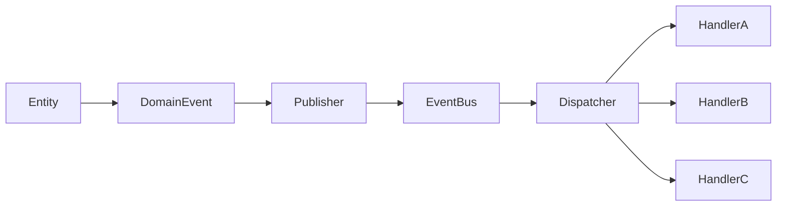
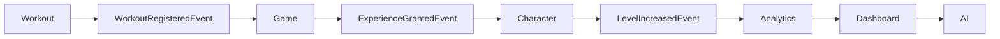

# EVENTS

## LifeOS

**Versão:** 1.0  
**Status:** Documento Oficial  
**Documento:** Arquitetura de Eventos  
**Arquiteturas Relacionadas:** Clean Architecture, DDD, Arquitetura Hexagonal e Modular Monolith

---

# 1. Objetivo

Este documento define a arquitetura oficial de eventos do LifeOS.

Seu objetivo é estabelecer como informações importantes do domínio são propagadas entre módulos de forma desacoplada, previsível e escalável.

A arquitetura de eventos permite que diferentes módulos reajam a mudanças de estado sem depender diretamente uns dos outros, reduzindo acoplamento e preservando as fronteiras arquiteturais definidas para o sistema.

Toda comunicação assíncrona entre módulos deverá seguir as regras estabelecidas neste documento.

---

# 2. Escopo

Este documento define:

- o conceito oficial de eventos do LifeOS;
- Domain Events;
- Application Events;
- Public Events;
- Event Bus;
- Event Publisher;
- Event Dispatcher;
- Event Registry;
- Event Handlers;
- convenções de nomenclatura;
- organização física;
- regras de publicação;
- regras de consumo;
- comunicação entre módulos.

Este documento complementa:

- `02_CLEAN_ARCHITECTURE.md`
- `03_DDD.md`
- `04_MODULAR_MONOLITH.md`
- `06_HEXAGONAL.md`
- `07_DEPENDENCY_RULES.md`

---

# 3. Filosofia da Arquitetura de Eventos

O LifeOS adota um modelo baseado em eventos para minimizar dependências entre módulos.

Os módulos não devem conhecer a implementação interna uns dos outros.

Sempre que uma ação relevante ocorrer dentro do domínio, ela deverá gerar um evento que represente um fato consumado.

Outros módulos poderão reagir a esse evento conforme suas próprias responsabilidades.

O módulo emissor nunca deve conhecer seus consumidores.

---

## Exemplo

```text
Workout Module

↓

WorkoutRegistered

↓

Game Module

↓

ExperienceGranted

↓

Character Module

↓

LevelIncreased

↓

Analytics Module

↓

Dashboard Module
```

Nenhum desses módulos possui dependência direta entre si.

Todos comunicam-se através de eventos.

---

# 4. O que é um Domain Event

Um Domain Event representa um fato importante ocorrido dentro do domínio.

Ele descreve algo que aconteceu e que não pode ser desfeito conceitualmente.

Eventos representam o passado.

Por esse motivo seus nomes devem utilizar verbos no particípio.

Exemplos:

```text
UserRegistered

WorkoutRegistered

SleepRecorded

ExperienceGranted

CharacterCreated

AchievementUnlocked

BookFinished

HabitCompleted

PasswordChanged

RecommendationGenerated
```

Eventos nunca representam intenções.

---

## Correto

```text
WorkoutRegistered
```

---

## Incorreto

```text
RegisterWorkout
```

O segundo representa uma ação futura e deve ser modelado como um Use Case ou Command.

---

# 5. Tipos de Eventos

O LifeOS utiliza três categorias oficiais de eventos.

```text
Domain Events

↓

Application Events

↓

Public Events
```

Cada categoria possui responsabilidades diferentes.

---

## 5.1 Domain Events

São eventos internos ao domínio.

Representam mudanças relevantes nas regras de negócio.

Características:

- imutáveis;
- pertencem ao domínio;
- publicados pelas Entities ou Domain Services;
- independentes de tecnologia;
- não conhecem consumidores.

Exemplos:

```text
WorkoutRegistered

ExperienceGranted

LevelIncreased

CharacterCreated

QuestCompleted
```

---

## 5.2 Application Events

São eventos utilizados pela camada de aplicação para coordenar casos de uso.

Podem representar:

- início de processos;
- conclusão de processos;
- integrações entre módulos;
- notificações técnicas.

Exemplos:

```text
PasswordResetRequested

ExportStarted

ImportCompleted

AnalyticsGenerated
```

---

## 5.3 Public Events

São eventos expostos oficialmente para outros módulos.

Funcionam como contratos públicos.

Devem permanecer estáveis.

Exemplo:

```text
CharacterCreatedEvent

WorkoutRegisteredEvent

AchievementUnlockedEvent
```

Todo Public Event deverá estar localizado em:

```text
module/

public/

events.py
```

---

# 6. Arquitetura Geral de Eventos

Fluxo oficial:

```text
Entity

↓

Domain Event

↓

Event Publisher

↓

Event Bus

↓

Dispatcher

↓

Handlers

↓

Outros módulos
```

---

## Diagrama



---

# 7. Event Bus

O Event Bus é o componente responsável por transportar eventos entre produtores e consumidores.

Ele não contém regras de negócio.

Sua responsabilidade é exclusivamente distribuir eventos.

---

## Responsabilidades

- registrar handlers;
- publicar eventos;
- localizar consumidores;
- executar handlers;
- preservar ordem de execução quando necessário;
- registrar erros de processamento.

---

## O Event Bus não deve

- executar regras de negócio;
- modificar eventos;
- criar entidades;
- realizar consultas ao banco;
- conhecer módulos.

---

## Interface Oficial

```python
from typing import Protocol

from lifeos.shared.domain.domain_event import DomainEvent


class EventBus(Protocol):

    def publish(
        self,
        event: DomainEvent,
    ) -> None:
        ...

    def register(
        self,
        event_type: type[DomainEvent],
        handler: "EventHandler",
    ) -> None:
        ...
```

---

# 8. Event Publisher

O Event Publisher é responsável por publicar eventos gerados pelo domínio.

Ele representa a fronteira entre o domínio e o mecanismo de distribuição.

---

## Responsabilidades

- receber Domain Events;
- encaminhar eventos ao Event Bus;
- preservar a imutabilidade dos eventos;
- garantir publicação única.

---

## Exemplo

```python
event = WorkoutRegisteredEvent(
    event_id=event_id,
    workout_id=workout.id,
    user_id=user.id,
    occurred_at=clock.now(),
)

event_publisher.publish(event)
```

---

## Regras

O Publisher:

- não interpreta eventos;
- não executa handlers;
- não modifica dados;
- não conhece consumidores.

---

# 9. Event Dispatcher

O Dispatcher é responsável por localizar os consumidores de um evento e executá-los.

Enquanto o Event Bus transporta eventos, o Dispatcher realiza sua distribuição.

---

## Fluxo

```text
Event Bus

↓

Dispatcher

↓

Handler 1

↓

Handler 2

↓

Handler 3
```

---

## Responsabilidades

- localizar handlers registrados;
- executar handlers;
- controlar sequência;
- registrar falhas;
- impedir execução duplicada quando necessário.

---

## Interface

```python
from typing import Protocol

from lifeos.shared.domain.domain_event import DomainEvent


class EventDispatcher(Protocol):

    def dispatch(
        self,
        event: DomainEvent,
    ) -> None:
        ...
```

---

# 10. Event Registry

O Event Registry mantém o catálogo oficial de eventos e seus respectivos consumidores.

Ele funciona como uma tabela de roteamento da aplicação.

---

## Objetivos

- registrar handlers;
- evitar configurações espalhadas;
- permitir inspeção da arquitetura;
- facilitar testes;
- facilitar evolução.

---

## Estrutura Conceitual

```text
WorkoutRegistered

↓

GameExperienceHandler

↓

AnalyticsWorkoutHandler

↓

DashboardWorkoutHandler
```

---

## Exemplo

```python
event_registry.register(
    WorkoutRegisteredEvent,
    GrantWorkoutExperienceHandler,
)

event_registry.register(
    WorkoutRegisteredEvent,
    AnalyticsWorkoutHandler,
)

event_registry.register(
    WorkoutRegisteredEvent,
    DashboardWorkoutHandler,
)
```

---

## Organização Física

```text
src/

lifeos/

infrastructure/

events/

event_bus.py

event_dispatcher.py

event_registry.py

event_publisher.py

handlers/
```

---

## Benefícios

O Event Registry permite:

- identificar rapidamente quem consome determinado evento;
- detectar dependências indevidas;
- facilitar auditoria arquitetural;
- simplificar testes de integração;
- reduzir acoplamento entre módulos.

Ele será a fonte oficial de registro de consumidores de eventos no LifeOS.

---

# 11. Convenção de Nomenclatura

A nomenclatura dos eventos deve ser consistente em todo o LifeOS.

Eventos representam fatos consumados e, portanto, seus nomes devem ser escritos no passado.

---

## Padrão Oficial

```text
<Entidade><AçãoConcluída>Event
```

Exemplos:

```text
UserRegisteredEvent

PasswordChangedEvent

WorkoutRegisteredEvent

WorkoutUpdatedEvent

WorkoutDeletedEvent

SleepRecordedEvent

HabitCompletedEvent

HabitBrokenEvent

BookStartedEvent

BookFinishedEvent

TherapySessionRecordedEvent

CharacterCreatedEvent

ExperienceGrantedEvent

LevelIncreasedEvent

QuestCompletedEvent

AchievementUnlockedEvent

RecommendationGeneratedEvent
```

---

## Convenções

Todos os eventos devem:

- utilizar PascalCase;
- terminar com o sufixo `Event`;
- representar acontecimentos;
- ser imutáveis;
- possuir nome claro;
- evitar abreviações.

---

## Nomes Proibidos

```text
DoWorkout

CreateUser

GrantXP

GenerateDashboard

RunAnalytics

UpdateCharacter
```

Esses nomes representam comandos ou intenções.

---

# 12. Estrutura Física

Todos os eventos devem seguir uma organização padronizada.

## Domain Events

```text
modules/

character/

domain/

events/

character_created_event.py

level_increased_event.py

experience_granted_event.py
```

---

## Public Events

```text
modules/

character/

public/

events.py
```

---

## Event Handlers

```text
modules/

character/

application/

event_handlers/
```

---

## Infraestrutura

```text
src/

lifeos/

infrastructure/

events/

event_bus.py

event_dispatcher.py

event_registry.py

event_publisher.py

event_store.py

handlers/
```

---

# 13. Catálogo Oficial de Eventos

Os eventos abaixo representam o catálogo inicial do LifeOS.

---

## Authentication

```text
UserRegisteredEvent

UserAuthenticatedEvent

PasswordResetRequestedEvent

PasswordChangedEvent

UserLoggedOutEvent
```

---

## Character

```text
CharacterCreatedEvent

CharacterUpdatedEvent

LevelIncreasedEvent

TitleUnlockedEvent

AttributeIncreasedEvent
```

---

## Workout

```text
WorkoutRegisteredEvent

WorkoutUpdatedEvent

WorkoutDeletedEvent

WorkoutCompletedEvent
```

---

## Health

```text
SleepRecordedEvent

RecoveryCalculatedEvent

BodyCompositionUpdatedEvent

HeartRateRecordedEvent
```

---

## Reading

```text
BookStartedEvent

BookFinishedEvent

ReadingSessionRecordedEvent

InsightRegisteredEvent
```

---

## Therapy

```text
TherapySessionRecordedEvent

TherapistRegisteredEvent
```

---

## Habits

```text
HabitCreatedEvent

HabitCompletedEvent

HabitBrokenEvent

HabitStreakUpdatedEvent
```

---

## Game

```text
ExperienceGrantedEvent

QuestStartedEvent

QuestCompletedEvent

AchievementUnlockedEvent

RewardGrantedEvent

SkillUnlockedEvent
```

---

## Analytics

```text
DashboardGeneratedEvent

InsightGeneratedEvent

CorrelationCalculatedEvent
```

---

## AI

```text
RecommendationGeneratedEvent

MissionSuggestedEvent

CoachMessageGeneratedEvent
```

---

## Reports

```text
ReportGeneratedEvent

ExportCompletedEvent
```

---

## Administration

```text
BackupCreatedEvent

BackupRestoredEvent

ConfigurationChangedEvent
```

---

# 14. Fluxos Oficiais de Eventos

## Cadastro de Usuário

```text
UserRegisteredEvent

↓

CharacterCreatedEvent

↓

WelcomeQuestGrantedEvent

↓

DashboardInitializedEvent
```

---

## Registro de Treino

```text
WorkoutRegisteredEvent

↓

ExperienceGrantedEvent

↓

LevelIncreasedEvent

↓

DashboardUpdatedEvent

↓

RecommendationGeneratedEvent
```

---

## Registro de Sono

```text
SleepRecordedEvent

↓

RecoveryCalculatedEvent

↓

AnalyticsUpdatedEvent

↓

RecommendationGeneratedEvent
```

---

## Leitura

```text
ReadingSessionRecordedEvent

↓

BookFinishedEvent

↓

ExperienceGrantedEvent

↓

AchievementUnlockedEvent
```

---

## Terapia

```text
TherapySessionRecordedEvent

↓

RecoveryRecalculatedEvent

↓

RecommendationGeneratedEvent
```

---

## Fluxo Geral



---

# 15. Garantias

Todo evento publicado deverá garantir:

- imutabilidade;
- identificação única;
- data e hora de ocorrência;
- identificação do Player;
- rastreabilidade;
- publicação única por ocorrência.

Nenhum Handler poderá modificar o evento recebido.

---

# 16. Idempotência

Handlers devem ser idempotentes sempre que possível.

Isso significa que um mesmo evento poderá ser processado novamente sem produzir efeitos incorretos.

Exemplo:

```text
WorkoutRegisteredEvent

↓

GrantExperienceHandler
```

Caso o evento seja recebido duas vezes, o Handler deve detectar duplicidade antes de conceder XP novamente.

---

## Estratégias

- Event ID único;
- Event Store;
- tabela de eventos processados;
- hash de processamento;
- controle transacional.

---

# 17. Consistência

O LifeOS adota dois modelos de consistência.

---

## Consistência Imediata

Utilizada quando:

- o resultado faz parte do mesmo caso de uso;
- o usuário precisa visualizar imediatamente a alteração.

Exemplos:

- autenticação;
- cadastro;
- atualização do Character.

---

## Consistência Eventual

Utilizada quando:

- Analytics;
- Dashboard;
- IA;
- relatórios;
- notificações.

Esses módulos podem reagir posteriormente aos eventos publicados.

---

# 18. Ordem dos Eventos

Quando múltiplos eventos forem publicados durante uma mesma operação, a ordem deverá ser preservada.

Exemplo:

```text
WorkoutRegisteredEvent

↓

ExperienceGrantedEvent

↓

LevelIncreasedEvent

↓

AchievementUnlockedEvent
```

A inversão dessa sequência poderá gerar inconsistências.

---

## Regra

Eventos derivados nunca devem ser publicados antes do evento que os originou.

---

# 19. Retry

Falhas temporárias durante o processamento de eventos deverão permitir nova tentativa.

O mecanismo de Retry pertence ao Event Bus ou Event Dispatcher.

---

## Situações elegíveis

- indisponibilidade de serviço externo;
- timeout;
- erro transitório de infraestrutura;
- falha temporária de comunicação.

---

## Situações não elegíveis

- violação de regra de negócio;
- evento inválido;
- dados inconsistentes;
- contrato quebrado.

---

## Estratégia

Exemplo:

```text
Tentativa 1

↓

Falhou

↓

Esperar 2 segundos

↓

Tentativa 2

↓

Falhou

↓

Esperar 5 segundos

↓

Tentativa 3

↓

Registrar erro
```

---

# 20. Event Store

O Event Store é o componente responsável por registrar os eventos publicados para fins de auditoria, rastreabilidade e diagnóstico.

Na versão inicial do LifeOS ele terá caráter operacional e **não implementará Event Sourcing**.

---

## Objetivos

- registrar histórico de eventos;
- permitir auditoria;
- facilitar depuração;
- suportar análise de falhas;
- registrar tentativas de processamento.

---

## Estrutura Conceitual

```text
Event ID

Event Type

Aggregate ID

User ID

Occurred At

Published At

Status

Attempts
```

---

## Organização Física

```text
src/

lifeos/

infrastructure/

events/

event_store.py
```

---

## Observação

O Event Store não substitui o banco de dados principal.

Ele é um mecanismo de apoio para observabilidade e rastreabilidade dos eventos publicados pelo sistema.

---

# 21. Dead Events

Dead Events são eventos publicados que não possuem consumidores registrados ou que não puderam ser processados com sucesso.

Embora possam indicar uma situação válida, também podem revelar problemas de arquitetura ou configuração.

---

## Objetivos

O tratamento de Dead Events permite:

- detectar eventos órfãos;
- identificar falhas de configuração;
- facilitar auditoria;
- apoiar depuração;
- evitar perda silenciosa de informações.

---

## Situações que geram Dead Events

### Evento sem Handler

```text
WorkoutRegisteredEvent

↓

Nenhum Handler Registrado
```

---

### Handler removido

```text
Event Publicado

↓

Handler inexistente
```

---

### Erro permanente

```text
Event

↓

Handler

↓

Exception

↓

Retry

↓

Retry

↓

Retry

↓

Dead Event
```

---

## Estratégia Oficial

Após exceder o número máximo de tentativas de processamento, o evento deverá ser marcado como **Dead Event**.

O Event Bus deverá registrar:

- Event ID;
- Event Type;
- Aggregate ID;
- User ID;
- Timestamp;
- Número de tentativas;
- Stack Trace;
- Motivo da falha.

---

## Regras

Dead Events:

- não devem ser descartados;
- devem permanecer registrados;
- devem permitir reprocessamento manual quando aplicável;
- devem ser monitorados.

---

# 22. Eventos Proibidos

Nem toda informação deve ser propagada através de eventos.

Eventos devem representar acontecimentos relevantes do domínio.

---

## Não utilizar eventos para

### Operações CRUD triviais

Exemplo:

```text
ButtonClickedEvent

FieldUpdatedEvent

TextboxChangedEvent
```

---

### Atualizações exclusivamente visuais

Exemplo:

```text
DashboardOpenedEvent

TabChangedEvent

ThemeChangedEvent
```

---

### Comunicação síncrona obrigatória

Se um módulo precisa de uma resposta imediata para concluir um caso de uso, deve utilizar uma Facade pública ou Input Port.

Não utilizar eventos.

---

### Transferência de objetos completos

Proibido:

```python
WorkoutRegisteredEvent(
    workout=Workout(...)
)
```

Correto:

```python
WorkoutRegisteredEvent(
    workout_id="...",
    user_id="...",
    occurred_at=...
)
```

Eventos devem transportar apenas os dados necessários.

---

### Eventos genéricos

Evitar nomes como:

```text
SomethingChangedEvent

DataUpdatedEvent

GenericEvent

ActionExecutedEvent
```

Eventos devem comunicar claramente o fato ocorrido.

---

# 23. Eventos e Multi-Tenant

Todos os eventos do LifeOS devem respeitar o isolamento entre usuários.

Nenhum evento poderá provocar efeitos sobre dados pertencentes a outro Player.

---

## Identificação obrigatória

Todo evento público deverá conter:

```text
Event ID

Aggregate ID

User ID

Occurred At
```

Quando aplicável:

```text
Tenant ID
```

---

## Exemplo

```python
@dataclass(frozen=True)
class WorkoutRegisteredEvent:

    event_id: str

    user_id: str

    workout_id: str

    occurred_at: datetime
```

---

## Regras

Handlers devem sempre utilizar o identificador do usuário recebido no evento.

Nunca utilizar:

- usuário da sessão;
- usuário global;
- cache compartilhado;
- valores fixos.

---

## Garantias

O processamento de um evento deve:

- manter isolamento entre usuários;
- impedir acesso cruzado;
- preservar consistência do tenant.

---

# 24. Como o Gemini deve utilizar este documento

Sempre que o agente implementar uma funcionalidade deverá avaliar se ela produz um fato relevante do domínio.

Caso positivo, deverá seguir o fluxo abaixo.

---

## Passo 1

Identificar se ocorreu um fato de negócio.

Exemplo:

```text
Treino registrado

Livro concluído

Nível aumentado

Meta alcançada
```

---

## Passo 2

Criar o Domain Event correspondente.

---

## Passo 3

Determinar se o evento será público.

Caso outros módulos precisem reagir, expor o evento em:

```text
module/

public/

events.py
```

---

## Passo 4

Registrar o Handler.

---

## Passo 5

Registrar o Handler no Event Registry.

---

## Passo 6

Verificar se já existe evento equivalente.

Evitar duplicidade.

---

## Passo 7

Atualizar a documentação.

Sempre que um novo evento público for criado deverão ser atualizados:

- catálogo oficial;
- fluxos;
- matriz de consumidores;
- testes.

---

# 25. Checklist de Implementação

Antes de concluir uma implementação baseada em eventos verificar:

- [ ] O evento representa um fato consumado.
- [ ] O nome segue a convenção oficial.
- [ ] O evento é imutável.
- [ ] Possui Event ID.
- [ ] Possui Aggregate ID.
- [ ] Possui User ID quando aplicável.
- [ ] Não transporta Entities.
- [ ] Não transporta objetos ORM.
- [ ] O Handler está registrado.
- [ ] O Event Registry foi atualizado.
- [ ] Existem testes para publicação.
- [ ] Existem testes para consumo.
- [ ] O fluxo não cria dependências circulares.
- [ ] O evento respeita isolamento Multi-Tenant.
- [ ] O catálogo oficial foi atualizado.

---

# 26. Anti-patterns

As práticas abaixo são proibidas.

---

## Evento representando comando

Errado:

```text
CreateWorkoutEvent

RegisterBookEvent

GrantExperienceEvent
```

Correto:

```text
WorkoutRegisteredEvent

BookFinishedEvent

ExperienceGrantedEvent
```

---

## Evento contendo Entity

Errado:

```python
WorkoutRegisteredEvent(
    workout=Workout(...)
)
```

---

## Evento contendo Session

```python
WorkoutRegisteredEvent(
    session=session
)
```

---

## Evento contendo Repository

```python
WorkoutRegisteredEvent(
    repository=repository
)
```

---

## Handler contendo regra principal de negócio

O Handler apenas reage ao evento.

A regra deve permanecer:

- na Entity;
- no Domain Service;
- no Use Case.

---

## Handler acessando outro módulo internamente

Errado:

```python
from lifeos.modules.character.domain.entities.character import Character
```

Correto:

```python
from lifeos.modules.character.public.facade import CharacterModuleFacade
```

---

## Publicação manual em qualquer ponto do código

A publicação deve ocorrer apenas em pontos oficiais da arquitetura, normalmente:

- Domain Services;
- Application Services;
- Use Cases.

Nunca em:

- páginas Streamlit;
- componentes visuais;
- ViewModels;
- Presenters.

---

## Evento alterando estado diretamente

Eventos comunicam fatos.

Quem altera estado são:

- Use Cases;
- Entities;
- Domain Services.

---

## Dependência entre Handlers

Handlers não devem chamar diretamente outros Handlers.

Caso uma nova ação seja necessária, deve ser publicado um novo evento.

---

## Conclusão

A arquitetura de eventos do LifeOS existe para desacoplar módulos, preservar as fronteiras do domínio e permitir evolução contínua do sistema.

Eventos representam fatos do negócio.

Handlers representam reações.

O Event Bus representa o mecanismo de comunicação.

Esses três conceitos devem permanecer independentes para garantir uma arquitetura limpa, testável e escalável.
