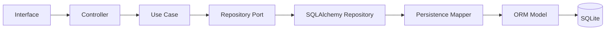

# DATABASE

## LifeOS

**Versão:** 1.1  
**Status:** Documento Oficial  
**Documento:** Arquitetura de Persistência e Banco de Dados  
**Tecnologias Iniciais:** SQLite, SQLAlchemy e Alembic  
**Arquiteturas Relacionadas:** Clean Architecture, DDD, Arquitetura Hexagonal e Monólito Modular

---

# 1. Objetivo

Este documento define a estratégia oficial de persistência e banco de dados do LifeOS.

Seu objetivo é estabelecer:

- como os dados serão armazenados;
- como o acesso ao banco será organizado;
- como as transações serão controladas;
- como o isolamento Multi-Tenant será garantido;
- como Entities de domínio serão separadas dos modelos ORM;
- como migrações serão versionadas;
- como integridade, auditoria, backup e recuperação serão tratados;
- quais regras desenvolvedores e agentes de IA deverão seguir.

Toda implementação relacionada à persistência deverá respeitar as diretrizes definidas neste documento.

---

# 2. Escopo

Este documento cobre:

- estratégia de persistência;
- banco de dados inicial;
- ORM oficial;
- organização física da camada de dados;
- conexão e gerenciamento de sessões;
- Unit of Work;
- transações;
- Repository Pattern;
- Models do ORM;
- Persistence Mappers;
- convenções de tabelas e colunas;
- identificadores;
- relacionamentos;
- integridade referencial;
- isolamento Multi-Tenant;
- auditoria;
- soft delete;
- migrações;
- seed;
- índices;
- backup e restore;
- segurança;
- testes;
- observabilidade;
- regras para agentes de IA.

Os detalhes específicos das tabelas serão definidos em:

- `ERD.md`;
- `SCHEMA.md`;
- `MIGRATIONS.md`;
- `INDEXES.md`.

---

# 3. Princípios da Persistência

A camada de persistência deve obedecer aos seguintes princípios:

1. O domínio não conhece o banco.
2. Entities não são Models do ORM.
3. Toda persistência ocorre por Repositories.
4. Transações pertencem à Application Layer.
5. SQLAlchemy permanece na Infrastructure.
6. Nenhuma interface acessa o banco diretamente.
7. Toda consulta operacional respeita o `user_id`.
8. Migrações são obrigatórias para alterações de schema.
9. Integridade deve ser protegida pelo domínio e pelo banco.
10. Dados sensíveis devem receber tratamento apropriado.
11. Backup e restauração devem ser testáveis.
12. A persistência deve poder migrar de SQLite para PostgreSQL sem alterar o domínio.

---

# 4. Banco de Dados Inicial

O banco oficial da primeira versão será:

```text
SQLite
```

Arquivo padrão:

```text
data/database/database.db
```

SQLite foi escolhido por:

- funcionamento local;
- ausência de servidor externo;
- simplicidade operacional;
- privacidade;
- baixo custo;
- facilidade de backup;
- adequação ao volume inicial de dados.

SQLite é uma decisão de infraestrutura.

O Domain e a Application não podem depender de características específicas dele.

---

# 5. ORM Oficial

O ORM oficial será:

```text
SQLAlchemy
```

Responsabilidades:

- mapear tabelas;
- gerenciar conexões;
- executar consultas;
- implementar Repositories;
- controlar persistência;
- integrar transações.

SQLAlchemy deve existir apenas em:

```text
src/lifeos/infrastructure/database/
src/lifeos/modules/*/infrastructure/models/
src/lifeos/modules/*/infrastructure/repositories/
src/lifeos/modules/*/infrastructure/persistence/
migrations/
```

É proibido utilizar SQLAlchemy em:

```text
domain/
application/
presentation/
interfaces/
```

---

# 6. Visão Arquitetural da Persistência



---

# 7. Separação entre Domain Entity e ORM Model

Entities e Models do ORM possuem responsabilidades diferentes.

## Domain Entity

Representa comportamento e regras do negócio.

Exemplo:

```python
class Character:
    def grant_experience(self, amount: ExperiencePoints) -> None:
        ...
```

## ORM Model

Representa estrutura de persistência.

Exemplo:

```python
class CharacterModel(Base):
    __tablename__ = "characters"

    id: Mapped[str] = mapped_column(primary_key=True)
    user_id: Mapped[str] = mapped_column(index=True)
    total_experience: Mapped[int] = mapped_column(default=0)
```

O ORM Model:

- não possui regra de negócio;
- não calcula nível;
- não concede XP;
- não valida progressão;
- não substitui a Entity.

---

# 8. Persistence Mapper

A conversão entre Domain Entity e ORM Model deve ocorrer por Persistence Mapper.

Fluxo:

```text
ORM Model
   ↕
Persistence Mapper
   ↕
Domain Entity
```

Exemplo:

```python
class CharacterPersistenceMapper:
    @staticmethod
    def to_domain(model: CharacterModel) -> Character:
        return Character.restore(
            character_id=CharacterId(model.id),
            user_id=UserId(model.user_id),
            total_experience=ExperiencePoints(model.total_experience),
            created_at=model.created_at,
            updated_at=model.updated_at,
        )

    @staticmethod
    def to_model(entity: Character) -> CharacterModel:
        return CharacterModel(
            id=str(entity.id),
            user_id=str(entity.user_id),
            total_experience=entity.total_experience.value,
            created_at=entity.created_at,
            updated_at=entity.updated_at,
        )
```

Mappers não podem conter regras de negócio.

---

# 9. Repository Pattern

Toda operação de persistência deve passar por um Repository.

## Interface no Domain

```python
from typing import Protocol


class CharacterRepository(Protocol):
    def find_by_id(
        self,
        character_id: CharacterId,
        user_id: UserId,
    ) -> Character | None:
        ...

    def save(self, character: Character) -> None:
        ...
```

## Implementação na Infrastructure

```python
class SqlAlchemyCharacterRepository(CharacterRepository):
    def __init__(self, session: Session) -> None:
        self._session = session

    def find_by_id(
        self,
        character_id: CharacterId,
        user_id: UserId,
    ) -> Character | None:
        model = (
            self._session.query(CharacterModel)
            .filter(
                CharacterModel.id == str(character_id),
                CharacterModel.user_id == str(user_id),
            )
            .one_or_none()
        )

        if model is None:
            return None

        return CharacterPersistenceMapper.to_domain(model)
```

---

# 10. Regras de Repository

Repositories devem:

- trabalhar com Aggregate Roots;
- receber identificadores de domínio;
- aplicar filtro Multi-Tenant;
- retornar Entities ou DTOs de leitura apropriados;
- esconder detalhes do ORM;
- participar da transação corrente;
- não executar commit por conta própria;
- não conter regras de negócio.

Repositories não devem:

- retornar Models SQLAlchemy;
- expor Session;
- conhecer Streamlit;
- executar regras de XP;
- montar ViewModels;
- acessar banco de outro módulo.

---

# 11. Session Factory

A criação de sessões será centralizada.

Estrutura oficial:

```text
src/lifeos/infrastructure/database/session_factory.py
```

Exemplo:

```python
from sqlalchemy.orm import Session, sessionmaker


class SqlAlchemySessionFactory:
    def __init__(self, session_maker: sessionmaker[Session]) -> None:
        self._session_maker = session_maker

    def create(self) -> Session:
        return self._session_maker()
```

Nenhum módulo deve criar `Session` diretamente.

---

# 12. Engine

A configuração do Engine ficará em:

```text
src/lifeos/infrastructure/database/engine.py
```

Exemplo conceitual:

```python
from sqlalchemy import create_engine


def create_database_engine(database_url: str):
    return create_engine(
        database_url,
        future=True,
        pool_pre_ping=True,
    )
```

A URL do banco será obtida pela camada de configuração e injetada no Bootstrap.

---

# 13. Unit of Work

O LifeOS utilizará Unit of Work para coordenar transações.

Objetivos:

- agrupar múltiplos Repositories;
- garantir commit único;
- garantir rollback;
- preservar consistência;
- controlar o ciclo de vida da Session.

Interface:

```python
from typing import Protocol


class UnitOfWork(Protocol):
    def __enter__(self) -> "UnitOfWork":
        ...

    def __exit__(
        self,
        exc_type: object,
        exc_value: object,
        traceback: object,
    ) -> None:
        ...

    def commit(self) -> None:
        ...

    def rollback(self) -> None:
        ...
```

---

# 14. Implementação de Unit of Work

Exemplo:

```python
class SqlAlchemyUnitOfWork:
    def __init__(self, session_factory: SqlAlchemySessionFactory) -> None:
        self._session_factory = session_factory
        self.session: Session | None = None

    def __enter__(self) -> "SqlAlchemyUnitOfWork":
        self.session = self._session_factory.create()
        return self

    def __exit__(
        self,
        exc_type: object,
        exc_value: object,
        traceback: object,
    ) -> None:
        if self.session is None:
            return

        if exc_type is not None:
            self.session.rollback()

        self.session.close()

    def commit(self) -> None:
        if self.session is None:
            raise RuntimeError("Unit of Work is not active.")

        self.session.commit()

    def rollback(self) -> None:
        if self.session is not None:
            self.session.rollback()
```

---

# 15. Controle Transacional

Transações pertencem à Application Layer.

Exemplo:

```python
class RegisterUserUseCase:
    def execute(self, command: RegisterUserCommand) -> RegisterUserOutput:
        with self._unit_of_work as uow:
            user = User.register(...)
            self._user_repository.save(user)

            self._character_facade.create_initial_character(
                user_id=str(user.id),
                player_name=user.name,
            )

            uow.commit()

        return RegisterUserOutput(user_id=str(user.id))
```

---

# 16. Regras de Transação

Toda operação que altera múltiplos registros relacionados deve ser transacional.

Exemplos:

- cadastro de usuário e Character;
- registro de treino e evento de domínio;
- concessão de XP e atualização de nível;
- conclusão de Quest e concessão de Reward;
- redefinição de senha e invalidação de token;
- restauração de backup.

Em caso de erro:

```text
Rollback completo
```

Nenhum estado parcial deve permanecer persistido.

---

# 17. Multi-Tenant

O LifeOS utiliza isolamento lógico por usuário.

Toda tabela operacional deverá possuir:

```text
user_id
```

ou uma referência equivalente ao proprietário do dado.

Toda consulta deverá aplicar:

```sql
WHERE user_id = :current_user_id
```

Nenhum Repository operacional deve buscar dados apenas por `id`.

---

# 18. Regra de Isolamento

Exemplo incorreto:

```python
def find_by_id(self, record_id: str) -> Record | None:
    ...
```

Exemplo correto:

```python
def find_by_id(
    self,
    record_id: str,
    user_id: str,
) -> Record | None:
    ...
```

A identidade autenticada deve vir do contexto da Application, não de um campo livre informado pelo formulário.

---

# 19. Restrições Multi-Tenant

Toda tabela operacional deve possuir:

- chave estrangeira para o usuário;
- índice por `user_id`;
- constraints compostas quando necessário;
- exclusão e atualização restritas ao mesmo usuário.

Exemplo:

```text
UNIQUE(user_id, data)
```

quando existir apenas um registro diário por usuário.

---

# 20. Identificadores

O padrão oficial será **TSID (Time-Sorted Unique Identifier)** representado como string.

Exemplo:

```text
01H8XGJWBWBAQ9J2429S1V8G2P
```

Regras:

- gerado pela aplicação;
- ordenável por tempo de geração;
- nunca reutilizado;
- imutável;
- independente do banco;
- utilizado em todos os módulos.

Tipos de domínio recomendados:

```text
UserId
CharacterId
WorkoutId
QuestId
AchievementId
```

---

# 21. Convenção de Tabelas

Nomes de tabelas:

- em inglês;
- `snake_case`;
- no plural;
- semanticamente claros.

Exemplos:

```text
users
characters
workout_records
sleep_records
reading_sessions
therapy_sessions
habit_records
experience_transactions
quests
achievements
```

---

# 22. Convenção de Colunas

Nomes de colunas:

- em inglês;
- `snake_case`;
- sem abreviações ambíguas;
- consistentes entre tabelas.

Exemplos:

```text
created_at
updated_at
deleted_at
user_id
character_id
occurred_at
total_experience
body_fat_percentage
average_heart_rate
```

---

# 23. Colunas de Auditoria

Tabelas principais devem possuir:

```text
created_at
updated_at
```

Quando aplicável:

```text
created_by
updated_by
deleted_at
deleted_by
```

Datas devem ser armazenadas em UTC.

A apresentação converte para o fuso do usuário.

---

# 24. Tipos de Dados

Diretrizes iniciais:

| Conceito | Tipo recomendado |
|---|---|
| Identificador (TSID) | `VARCHAR(26)` |
| Texto curto | `VARCHAR(n)` |
| Texto longo | `TEXT` |
| Inteiro | `INTEGER` |
| Valor decimal | `NUMERIC(p, s)` |
| Data | `DATE` |
| Data e hora | `DATETIME` |
| Booleano | `BOOLEAN` |
| Percentual | `NUMERIC(5, 2)` |
| Peso | `NUMERIC(6, 2)` |
| Altura | `NUMERIC(6, 2)` |
| XP | `INTEGER` |

Para valores importantes, evitar `FLOAT` quando precisão determinística for necessária.

---

# 25. Datas e Horários

Regras:

- timestamps em UTC;
- datas puras como `DATE`;
- horários gerados via `Clock` injetado;
- nunca utilizar `datetime.now()` diretamente no Domain;
- sempre distinguir `occurred_at` de `created_at`.

Exemplo:

```text
occurred_at
```

representa quando a atividade aconteceu.

```text
created_at
```

representa quando o registro foi persistido.

---

# 26. Chaves Estrangeiras

Toda relação obrigatória deve possuir Foreign Key.

Exemplos:

```text
characters.user_id → users.id
workout_records.user_id → users.id
therapy_sessions.therapist_id → therapists.id
experience_transactions.character_id → characters.id
```

Foreign Keys devem estar habilitadas no SQLite.

---

# 27. Integridade Referencial

O banco deve reforçar regras estruturais.

Exemplos:

- e-mail único;
- Character único por usuário;
- valores não negativos;
- percentuais entre 0 e 100;
- referências válidas;
- datas obrigatórias;
- tokens únicos;
- XP não negativa.

O Domain continua sendo a primeira linha de defesa.

O banco atua como segunda barreira.

---

# 28. Constraints

Exemplos:

```sql
CHECK (total_experience >= 0)
CHECK (body_fat_percentage BETWEEN 0 AND 100)
CHECK (perceived_effort BETWEEN 0 AND 10)
CHECK (sleep_score BETWEEN 0 AND 10)
```

Constraints devem refletir invariantes estáveis.

Regras que mudam com frequência devem permanecer no domínio.

---

# 29. Relacionamentos

Relacionamentos devem ser modelados com clareza.

Exemplos:

```text
User 1 — 1 Character
User 1 — N Workout Records
User 1 — N Sleep Records
User 1 — N Reading Sessions
User 1 — N Therapy Sessions
Character 1 — N Experience Transactions
Character 1 — N Attributes
Quest 1 — N Quest Progress Records
```

O detalhamento completo será feito em `ERD.md`.

---

# 30. Cascades

Cascades devem ser utilizadas com cautela.

Permitido quando:

- o filho não possui significado sem o pai;
- a exclusão é parte do mesmo Aggregate;
- a regra é estável.

Evitar cascade em:

- dados históricos;
- auditoria;
- eventos;
- transações de XP;
- registros que precisam ser preservados.

---

# 31. Soft Delete

Soft delete será utilizado quando houver necessidade de:

- preservar histórico;
- permitir restauração;
- manter auditoria;
- evitar perda de dados.

Coluna padrão:

```text
deleted_at
```

Registros com `deleted_at` preenchido devem ser omitidos das consultas normais.

---

# 32. Exclusão Física

Exclusão física será permitida apenas para:

- dados temporários;
- tokens expirados;
- caches;
- arquivos gerados;
- registros sem valor histórico;
- dados de teste.

A exclusão física de dados do usuário deve seguir fluxo explícito e auditável.

---

# 33. Auditoria

Operações críticas devem gerar auditoria.

Exemplos:

- cadastro;
- login;
- alteração de senha;
- redefinição de senha;
- exportação;
- exclusão de conta;
- restore;
- alteração de configurações;
- concessão manual de XP;
- alteração administrativa.

Estrutura mínima:

```text
audit_logs
```

Campos:

```text
id
user_id
action
entity_type
entity_id
occurred_at
metadata_json
```

---

# 34. Eventos e Persistência

Domain Events devem ser publicados somente após a persistência bem-sucedida quando a consistência exigir.

Estratégia inicial:

```text
Transação
  ↓
Persistência
  ↓
Commit
  ↓
Publicação
```

Quando for necessário garantir atomicidade entre banco e eventos, poderá ser adotado Outbox Pattern em evolução futura.

---

# 35. Event Store

O Event Store operacional deve armazenar:

```text
event_id
event_type
aggregate_id
user_id
payload_json
occurred_at
published_at
status
attempts
error_message
```

Ele não substitui as tabelas de domínio.

Não caracteriza Event Sourcing.

---

# 36. Migrações

Toda alteração de schema deve possuir migration.

Ferramenta oficial:

```text
Alembic
```

Proibido:

- alterar tabelas manualmente em produção;
- criar colunas automaticamente sem migration;
- depender de `create_all()` como mecanismo de evolução;
- executar SQL improvisado no startup.

---

# 37. Versionamento do Schema

O schema será versionado de forma incremental.

Exemplo:

```text
0001_create_users
0002_create_characters
0003_create_workout_records
0004_add_user_id_indexes
```

Cada migration deve ser:

- pequena;
- reversível quando possível;
- testada;
- documentada;
- determinística.

---

# 38. Seed de Dados

Seeds devem ser usados para dados de referência.

Exemplos:

- atributos oficiais;
- tipos de exercícios padrão;
- títulos iniciais;
- configurações padrão;
- categorias de Quest.

Seeds não devem criar dados pessoais reais.

Estrutura:

```text
scripts/seed_database.py
```

---

# 39. Dados de Referência

Dados estáveis poderão ser persistidos em tabelas de referência.

Exemplos:

```text
attribute_types
workout_types
quest_types
achievement_categories
```

Mudanças nesses dados devem ser versionadas.

---

# 40. Índices

Todo índice deve possuir justificativa.

Índices mínimos esperados:

- `user_id`;
- datas de consulta;
- Foreign Keys;
- e-mail;
- tokens;
- combinações Multi-Tenant;
- status;
- campos usados frequentemente em filtros.

O detalhamento será definido em `INDEXES.md`.

---

# 41. Consultas

Consultas devem:

- selecionar apenas colunas necessárias;
- aplicar filtro Multi-Tenant;
- utilizar paginação quando aplicável;
- evitar N+1;
- utilizar joins explicitamente;
- evitar carregar Aggregates inteiros sem necessidade;
- possuir testes.

---

# 42. CQRS Light

Consultas complexas poderão utilizar modelos de leitura próprios.

Exemplo:

```text
CharacterSheetReadModel
DashboardSummaryReadModel
WeeklyAnalyticsReadModel
```

Esses modelos:

- não substituem o domínio;
- podem usar consultas otimizadas;
- são somente leitura;
- devem respeitar Multi-Tenant.

---

# 43. Paginação

Listagens potencialmente grandes devem ser paginadas.

Contrato sugerido:

```python
@dataclass(frozen=True)
class PageRequest:
    page: int
    size: int
```

```python
@dataclass(frozen=True)
class Page:
    items: tuple[object, ...]
    page: int
    size: int
    total_items: int
    total_pages: int
```

---

# 44. Ordenação

Toda listagem deve possuir ordenação determinística.

Exemplo:

```text
occurred_at DESC, id DESC
```

Não depender da ordem natural do banco.

---

# 45. Busca Textual

Na versão inicial, buscas textuais utilizarão recursos compatíveis com SQLite.

Futuramente, poderão migrar para:

- PostgreSQL Full Text Search;
- Elasticsearch;
- OpenSearch.

A Application deve depender de um Port, não da tecnologia de busca.

---

# 46. Backup

Backup deve copiar o arquivo SQLite de forma segura.

Diretório:

```text
data/backups/
```

Convenção:

```text
lifeos_YYYY-MM-DD_HH-mm-ss.db
```

Backups devem ser:

- automáticos;
- verificáveis;
- versionados por data;
- protegidos contra sobrescrita;
- sujeitos a política de retenção.

---

# 47. Política de Retenção

Configuração inicial:

```text
30 backups diários
```

A política deve ser configurável.

Backups antigos devem ser removidos apenas após confirmação de que backups recentes são válidos.

---

# 48. Restore

O restore deve:

1. validar o arquivo;
2. verificar integridade;
3. criar backup do estado atual;
4. interromper operações de escrita;
5. restaurar;
6. validar schema;
7. registrar auditoria;
8. reiniciar conexões.

Restore não deve ocorrer com transações ativas.

---

# 49. Verificação de Integridade

Antes e depois de backup ou restore, executar:

```sql
PRAGMA integrity_check;
```

O resultado esperado é:

```text
ok
```

Falhas devem impedir a conclusão do processo.

---

# 50. Segurança dos Dados

Regras:

- senhas armazenadas apenas como hash;
- tokens de reset preferencialmente armazenados como hash;
- segredos fora do banco;
- dados sensíveis não expostos em logs;
- exports protegidos;
- permissões de arquivo adequadas;
- dados de outro usuário nunca retornados;
- backups tratados como dados sensíveis.

---

# 51. Dados Sensíveis

Exemplos:

- senha;
- token;
- notas terapêuticas;
- informações biométricas;
- dados de saúde;
- recomendações pessoais;
- histórico de comportamento.

Esses dados exigem:

- acesso restrito;
- mascaramento quando apropriado;
- exclusão de logs;
- cuidado em exportações;
- isolamento Multi-Tenant.

---

# 52. Criptografia

Senhas não são criptografadas; são armazenadas por hash seguro.

Campos sensíveis adicionais poderão utilizar criptografia em repouso quando necessário.

A estratégia de criptografia será definida por Port e Adapter, evitando acoplamento do Domain.

---

# 53. Logs de Banco

Logs SQL devem ser desativados por padrão em produção.

Nunca registrar:

- senha;
- hash;
- token;
- notas terapêuticas completas;
- payloads sensíveis.

Logs de erro devem preservar contexto sem expor conteúdo privado.

---

# 54. Performance

Objetivos iniciais:

- consultas simples abaixo de 100 ms;
- carregamento de Dashboard abaixo de 2 segundos;
- suporte inicial a 100 mil registros por usuário;
- ausência de N+1;
- índices adequados;
- consultas paginadas.

Medições reais devem orientar otimizações.

---

# 55. Concorrência

SQLite possui limitações de concorrência de escrita.

A versão inicial deverá:

- manter transações curtas;
- evitar bloqueios prolongados;
- não executar processamento pesado dentro de transações;
- utilizar WAL quando validado;
- serializar operações críticas quando necessário.

---

# 56. Configuração SQLite

Configurações recomendadas, após validação:

```sql
PRAGMA foreign_keys = ON;
PRAGMA journal_mode = WAL;
PRAGMA synchronous = NORMAL;
PRAGMA busy_timeout = 5000;
```

Essas configurações devem ser aplicadas centralmente.

---

# 57. Evolução para PostgreSQL

A migração futura para PostgreSQL deverá preservar:

- Repository Interfaces;
- Use Cases;
- Domain;
- DTOs;
- contratos públicos.

Mudanças devem ficar restritas a:

- Engine;
- Models;
- Repositories concretos;
- migrations;
- configurações.

---

# 58. Testes Unitários

Testes unitários de Domain e Application não devem usar banco real.

Utilizar:

```text
InMemoryRepository
FakeUnitOfWork
FixedClock
FakeEventPublisher
```

---

# 59. Testes de Integração

Devem validar:

- mapeamento ORM;
- constraints;
- Foreign Keys;
- Repositories;
- Unit of Work;
- rollback;
- Multi-Tenant;
- migrations;
- índices críticos;
- backup e restore.

---

# 60. Testes de Contrato

Todas as implementações de um Repository devem passar pelo mesmo contrato.

Exemplo:

```text
CharacterRepositoryContract
├── InMemoryCharacterRepository
└── SqlAlchemyCharacterRepository
```

---

# 61. Banco de Teste

Testes de integração devem utilizar banco temporário isolado.

Nunca utilizar:

```text
data/database/database.db
```

nos testes automatizados.

---

# 62. Observabilidade

Métricas futuras:

- tempo de consulta;
- consultas lentas;
- quantidade de conexões;
- taxa de rollback;
- tamanho do banco;
- tempo de backup;
- falhas de migration;
- eventos pendentes;
- dead events.

---

# 63. Estrutura Física

```text
src/lifeos/infrastructure/database/
├── engine.py
├── session_factory.py
├── unit_of_work.py
├── transaction_manager.py
├── metadata.py
├── health_check.py
└── sqlite_configuration.py
```

Por módulo:

```text
module/infrastructure/
├── models/
├── repositories/
├── mappers/
└── persistence/
```

---

# 64. Anti-patterns

São proibidos:

## Entity como ORM Model

```python
class Character(Base):
    ...
```

usado como domínio.

## Commit dentro de Repository

```python
self._session.commit()
```

em cada método `save`.

## Session na UI

```python
session.query(...)
```

em página Streamlit.

## Consulta sem tenant

```python
filter(WorkoutModel.id == workout_id)
```

sem `user_id`.

## SQL espalhado

SQL em:

- páginas;
- Use Cases;
- Services de domínio;
- scripts sem abstração.

## Alteração automática de schema

Uso de `create_all()` como substituto de migrations.

## Exposição de Model ORM

Retornar `UserModel` para Controller ou UI.

---

# 65. Como o Gemini deve utilizar este documento

Antes de implementar persistência, o agente deve verificar:

1. Qual Aggregate será persistido?
2. Existe Repository Interface?
3. Existe ORM Model separado?
4. Existe Persistence Mapper?
5. A operação aplica `user_id`?
6. A transação pertence ao Use Case?
7. O Repository evita commit próprio?
8. A alteração exige migration?
9. Existe índice necessário?
10. Existem constraints adequadas?
11. Há dado sensível envolvido?
12. Existem testes de integração?
13. A implementação continua compatível com PostgreSQL futuro?

---

# 66. Checklist de Implementação

- [ ] Entity separada do ORM Model.
- [ ] Repository Interface no Domain.
- [ ] Implementação na Infrastructure.
- [ ] Persistence Mapper criado.
- [ ] Filtro Multi-Tenant aplicado.
- [ ] Foreign Keys definidas.
- [ ] Constraints definidas.
- [ ] Migration criada.
- [ ] Índices avaliados.
- [ ] Transação controlada por Unit of Work.
- [ ] Rollback testado.
- [ ] Logs não expõem dados sensíveis.
- [ ] Testes de integração criados.
- [ ] Backup avaliado quando necessário.
- [ ] Documentação atualizada.

---

# 67. Critérios de Aceite

Este documento será considerado atendido quando:

- a persistência estiver isolada na Infrastructure;
- Entities e ORM Models estiverem separados;
- Repositories ocultarem SQLAlchemy;
- Multi-Tenant for aplicado em todas as consultas;
- Unit of Work controlar transações;
- migrations versionarem o schema;
- constraints protegerem integridade;
- backup e restore forem documentados;
- dados sensíveis receberem tratamento adequado;
- testes validarem persistência e isolamento;
- a migração futura para PostgreSQL permanecer viável.

---

# 68. Definition of Done

Uma alteração de banco só estará concluída quando:

- [ ] O modelo de domínio estiver preservado.
- [ ] O ORM Model estiver criado ou atualizado.
- [ ] A migration existir.
- [ ] O Repository estiver atualizado.
- [ ] O Persistence Mapper estiver atualizado.
- [ ] O isolamento Multi-Tenant estiver garantido.
- [ ] Constraints e índices estiverem avaliados.
- [ ] Testes unitários e de integração passarem.
- [ ] Rollback estiver validado.
- [ ] Documentação estiver atualizada.
- [ ] Nenhuma camada externa violar as regras de dependência.

---

# 69. Declaração Final

O banco de dados é um mecanismo de persistência, não o centro do LifeOS.

O domínio define o significado dos dados.

A Application define os casos de uso.

A Infrastructure traduz esses conceitos para tabelas, consultas e transações.

Toda decisão de persistência deve preservar o isolamento Multi-Tenant, a integridade dos dados, a privacidade do Player e a independência tecnológica da plataforma.
