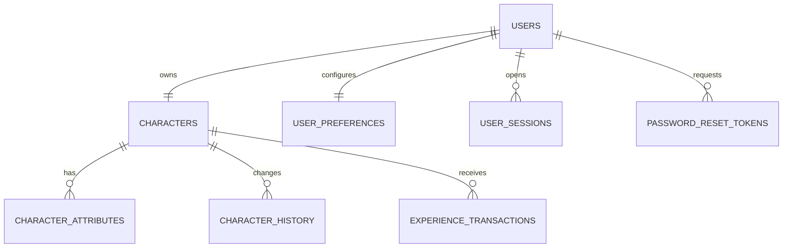
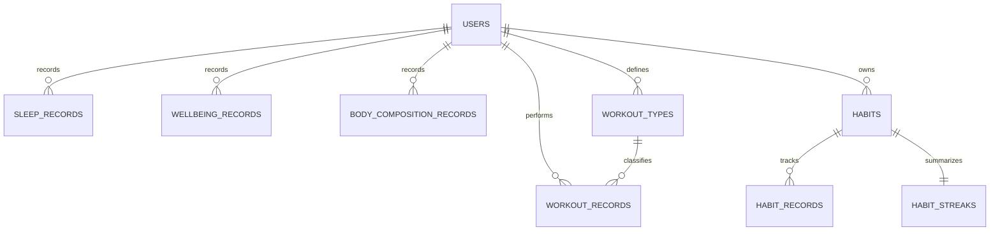
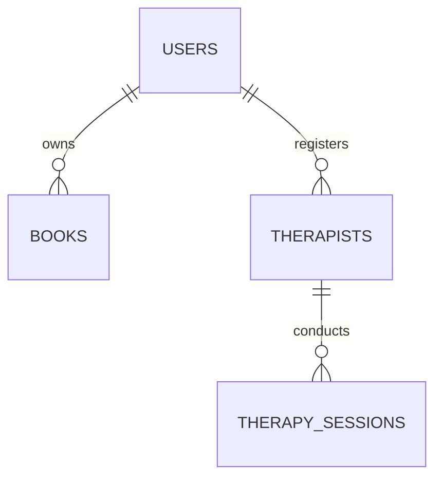
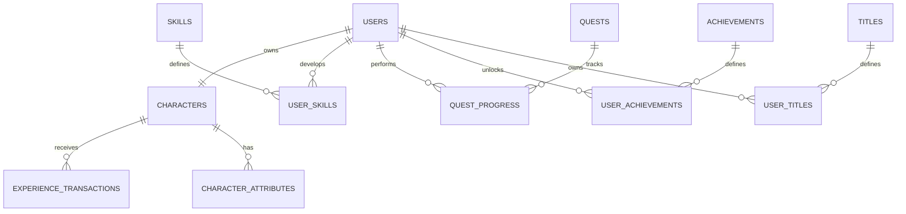
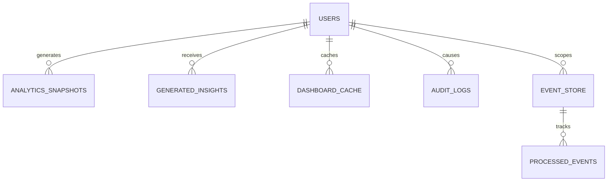

# ERD

## LifeOS

**Versão:** 1.0  
**Status:** Documento Oficial  
**Documento:** Entity-Relationship Diagram  
**Banco Inicial:** SQLite  
**ORM:** SQLAlchemy  
**Escopo:** Modelo relacional oficial da versão inicial do LifeOS

---

# 1. Objetivo

Este documento define o modelo entidade-relacionamento oficial do LifeOS.

Seu objetivo é representar:

- entidades persistidas;
- relacionamentos;
- cardinalidades;
- chaves primárias;
- chaves estrangeiras;
- isolamento Multi-Tenant;
- restrições principais;
- separação entre dados operacionais, gamificação, Analytics, autenticação e auditoria.

Este documento deve ser utilizado como referência para:

- criação do schema;
- Models SQLAlchemy;
- migrations;
- Repositories;
- consultas;
- testes de integração;
- revisão arquitetural;
- implementação por agentes de IA.

---

# 2. Escopo

O ERD inicial cobre os seguintes domínios:

- Authentication;
- Character;
- Health;
- Workout;
- Reading;
- Therapy;
- Habits;
- Gamification;
- Analytics;
- Reports;
- Administration;
- Event Store;
- Audit.

Entidades futuras poderão ser adicionadas desde que respeitem:

- isolamento por `user_id`;
- fronteiras modulares;
- regras de dependência;
- migrations versionadas;
- contratos públicos;
- consistência com o PRD e o `FEATURE_CATALOG.md`.

---

# 3. Princípios do Modelo Relacional

O modelo de dados deve respeitar:

1. Toda entidade operacional pertence a um usuário.
2. Toda tabela operacional deve possuir `user_id`.
3. Identificadores são UUID v4.
4. Datas de auditoria usam UTC.
5. Dados históricos não devem ser removidos sem regra explícita.
6. Entities de domínio não são Models SQLAlchemy.
7. Relacionamentos devem ser explícitos por Foreign Keys.
8. Constraints devem proteger invariantes estáveis.
9. Índices devem apoiar consultas reais.
10. O schema deve permanecer migrável para PostgreSQL.
11. Dados sensíveis devem possuir acesso restrito.
12. Tabelas de Analytics não substituem os dados operacionais.

---

# 4. Visão Geral dos Módulos Persistidos

```text
Authentication
├── users
├── user_preferences
├── user_sessions
└── password_reset_tokens

Character
├── characters
├── character_attributes
├── character_titles
└── character_history

Health
├── sleep_records
├── wellbeing_records
└── body_composition_records

Workout
├── workout_types
└── workout_records

Reading
└── books

Therapy
├── therapists
└── therapy_sessions

Habits
├── habits
├── habit_records
└── habit_streaks

Gamification
├── experience_transactions
├── skills
├── user_skills
├── quests
├── quest_progress
├── achievements
├── user_achievements
├── titles
└── user_titles

Analytics
├── analytics_snapshots
├── generated_insights
└── dashboard_cache

Administration
├── audit_logs
├── event_store
├── processed_events
└── application_settings
```

---

# 5. Diagrama ER Principal

```mermaid
erDiagram

    USERS ||--|| CHARACTERS : owns
    USERS ||--o{ USER_PREFERENCES : configures
    USERS ||--o{ USER_SESSIONS : opens
    USERS ||--o{ PASSWORD_RESET_TOKENS : requests

    USERS ||--o{ SLEEP_RECORDS : records
    USERS ||--o{ WELLBEING_RECORDS : records
    USERS ||--o{ BODY_COMPOSITION_RECORDS : records

    USERS ||--o{ WORKOUT_TYPES : owns
    USERS ||--o{ WORKOUT_RECORDS : performs
    WORKOUT_TYPES ||--o{ WORKOUT_RECORDS : classifies

    USERS ||--o{ BOOKS : owns

    USERS ||--o{ THERAPISTS : registers
    USERS ||--o{ THERAPY_SESSIONS : attends
    THERAPISTS ||--o{ THERAPY_SESSIONS : conducts

    USERS ||--o{ HABITS : owns
    HABITS ||--o{ HABIT_RECORDS : tracks
    HABITS ||--|| HABIT_STREAKS : summarizes

    CHARACTERS ||--o{ CHARACTER_ATTRIBUTES : has
    CHARACTERS ||--o{ EXPERIENCE_TRANSACTIONS : receives
    CHARACTERS ||--o{ CHARACTER_HISTORY : records

    SKILLS ||--o{ USER_SKILLS : defines
    USERS ||--o{ USER_SKILLS : develops

    QUESTS ||--o{ QUEST_PROGRESS : tracks
    USERS ||--o{ QUEST_PROGRESS : performs

    ACHIEVEMENTS ||--o{ USER_ACHIEVEMENTS : unlocks
    USERS ||--o{ USER_ACHIEVEMENTS : owns

    TITLES ||--o{ USER_TITLES : awards
    USERS ||--o{ USER_TITLES : owns

    USERS ||--o{ ANALYTICS_SNAPSHOTS : generates
    USERS ||--o{ GENERATED_INSIGHTS : receives
    USERS ||--o{ DASHBOARD_CACHE : caches

    USERS ||--o{ AUDIT_LOGS : causes
    USERS ||--o{ EVENT_STORE : scopes
    EVENT_STORE ||--o{ PROCESSED_EVENTS : tracks
```



---

# 6. Authentication

## 6.1 `users`

Representa a identidade principal do Player.

| Campo | Tipo | Regras |
|---|---|---|
| `id` | VARCHAR(36) | PK, UUID v4 |
| `full_name` | VARCHAR(150) | NOT NULL |
| `email` | VARCHAR(255) | NOT NULL, UNIQUE |
| `password_hash` | VARCHAR(255) | NOT NULL |
| `sex` | VARCHAR(20) | NULL |
| `height_cm` | NUMERIC(6,2) | NULL, CHECK > 0 |
| `status` | VARCHAR(30) | NOT NULL |
| `created_at` | DATETIME | NOT NULL |
| `updated_at` | DATETIME | NOT NULL |
| `deleted_at` | DATETIME | NULL |

Regras:

- e-mail é único;
- senha nunca é persistida em texto puro;
- exclusão lógica por `deleted_at`;
- cada usuário possui exatamente um Character ativo.

---

## 6.2 `user_preferences`

Armazena preferências de interface e produto.

| Campo | Tipo | Regras |
|---|---|---|
| `id` | VARCHAR(36) | PK |
| `user_id` | VARCHAR(36) | FK users.id |
| `theme` | VARCHAR(50) | NOT NULL |
| `language` | VARCHAR(10) | NOT NULL |
| `timezone` | VARCHAR(100) | NOT NULL |
| `email_notifications_enabled` | BOOLEAN | NOT NULL |
| `created_at` | DATETIME | NOT NULL |
| `updated_at` | DATETIME | NOT NULL |

Constraint recomendada:

```text
UNIQUE(user_id)
```

---

## 6.3 `user_sessions`

Controla sessões autenticadas.

| Campo | Tipo | Regras |
|---|---|---|
| `id` | VARCHAR(36) | PK |
| `user_id` | VARCHAR(36) | FK users.id |
| `session_token_hash` | VARCHAR(255) | NOT NULL, UNIQUE |
| `created_at` | DATETIME | NOT NULL |
| `expires_at` | DATETIME | NOT NULL |
| `revoked_at` | DATETIME | NULL |
| `last_activity_at` | DATETIME | NULL |

---

## 6.4 `password_reset_tokens`

Armazena tokens de redefinição.

| Campo | Tipo | Regras |
|---|---|---|
| `id` | VARCHAR(36) | PK |
| `user_id` | VARCHAR(36) | FK users.id |
| `token_hash` | VARCHAR(255) | NOT NULL, UNIQUE |
| `expires_at` | DATETIME | NOT NULL |
| `used_at` | DATETIME | NULL |
| `created_at` | DATETIME | NOT NULL |

Regras:

- token inválido após `used_at`;
- token inválido após `expires_at`;
- token bruto nunca deve ser persistido.

---

# 7. Character

## 7.1 `characters`

Representa o Character principal do Player.

| Campo | Tipo | Regras |
|---|---|---|
| `id` | VARCHAR(36) | PK |
| `user_id` | VARCHAR(36) | FK users.id, UNIQUE |
| `display_name` | VARCHAR(150) | NOT NULL |
| `avatar_path` | VARCHAR(500) | NULL |
| `global_level` | INTEGER | NOT NULL, CHECK >= 1 |
| `total_experience` | INTEGER | NOT NULL, CHECK >= 0 |
| `class_code` | VARCHAR(50) | NULL |
| `guild_name` | VARCHAR(100) | NULL |
| `active_title_id` | VARCHAR(36) | NULL |
| `created_at` | DATETIME | NOT NULL |
| `updated_at` | DATETIME | NOT NULL |

Constraint:

```text
UNIQUE(user_id)
```

---

## 7.2 `character_attributes`

Armazena os atributos oficiais do Character.

| Campo | Tipo | Regras |
|---|---|---|
| `id` | VARCHAR(36) | PK |
| `character_id` | VARCHAR(36) | FK characters.id |
| `attribute_code` | VARCHAR(10) | NOT NULL |
| `attribute_name` | VARCHAR(100) | NOT NULL |
| `level` | INTEGER | NOT NULL |
| `current_experience` | INTEGER | NOT NULL |
| `total_experience` | INTEGER | NOT NULL |
| `updated_at` | DATETIME | NOT NULL |

Códigos oficiais:

```text
COR
LIN
TRA
TER
LOG
MUS
ESP
NAT
```

Constraint:

```text
UNIQUE(character_id, attribute_code)
```

---

## 7.3 `character_history`

Registra mudanças relevantes do Character.

| Campo | Tipo | Regras |
|---|---|---|
| `id` | VARCHAR(36) | PK |
| `character_id` | VARCHAR(36) | FK characters.id |
| `user_id` | VARCHAR(36) | FK users.id |
| `event_type` | VARCHAR(100) | NOT NULL |
| `previous_value_json` | TEXT | NULL |
| `new_value_json` | TEXT | NULL |
| `occurred_at` | DATETIME | NOT NULL |

---

# 8. Health

## 8.1 `sleep_records`

| Campo | Tipo | Regras |
|---|---|---|
| `id` | VARCHAR(36) | PK |
| `user_id` | VARCHAR(36) | FK users.id |
| `record_date` | DATE | NOT NULL |
| `sleep_duration_hours` | NUMERIC(4,2) | NULL |
| `hrv_ms` | INTEGER | NULL |
| `resting_heart_rate_bpm` | INTEGER | NULL |
| `deep_sleep_minutes` | INTEGER | NULL |
| `rem_sleep_minutes` | INTEGER | NULL |
| `sleep_score` | INTEGER | NULL, CHECK 0..10 |
| `created_at` | DATETIME | NOT NULL |
| `updated_at` | DATETIME | NOT NULL |

Constraint:

```text
UNIQUE(user_id, record_date)
```

---

## 8.2 `wellbeing_records`

| Campo | Tipo | Regras |
|---|---|---|
| `id` | VARCHAR(36) | PK |
| `user_id` | VARCHAR(36) | FK users.id |
| `record_date` | DATE | NOT NULL |
| `mental_clarity` | INTEGER | CHECK 0..10 |
| `fatigue_level` | INTEGER | CHECK 0..10 |
| `concentration` | INTEGER | CHECK 0..10 |
| `screen_time_minutes` | INTEGER | CHECK >= 0 |
| `caffeine_mg` | INTEGER | CHECK >= 0 |
| `energy_level` | INTEGER | NULL, CHECK 0..10 |
| `created_at` | DATETIME | NOT NULL |
| `updated_at` | DATETIME | NOT NULL |

Constraint:

```text
UNIQUE(user_id, record_date)
```

---

## 8.3 `body_composition_records`

| Campo | Tipo | Regras |
|---|---|---|
| `id` | VARCHAR(36) | PK |
| `user_id` | VARCHAR(36) | FK users.id |
| `record_date` | DATE | NOT NULL |
| `weight_kg` | NUMERIC(6,2) | NULL |
| `body_fat_percentage` | NUMERIC(5,2) | NULL |
| `muscle_mass_kg` | NUMERIC(6,2) | NULL |
| `skeletal_muscle_mass_kg` | NUMERIC(6,2) | NULL |
| `lean_mass_kg` | NUMERIC(6,2) | NULL |
| `vo2_max` | NUMERIC(6,2) | NULL |
| `created_at` | DATETIME | NOT NULL |

---

# 9. Workout

## 9.1 `workout_types`

| Campo | Tipo | Regras |
|---|---|---|
| `id` | VARCHAR(36) | PK |
| `user_id` | VARCHAR(36) | FK users.id |
| `name` | VARCHAR(100) | NOT NULL |
| `category` | VARCHAR(50) | NULL |
| `active` | BOOLEAN | NOT NULL |
| `created_at` | DATETIME | NOT NULL |
| `updated_at` | DATETIME | NOT NULL |

Constraint:

```text
UNIQUE(user_id, name)
```

---

## 9.2 `workout_records`

| Campo | Tipo | Regras |
|---|---|---|
| `id` | VARCHAR(36) | PK |
| `user_id` | VARCHAR(36) | FK users.id |
| `workout_type_id` | VARCHAR(36) | FK workout_types.id |
| `occurred_at` | DATETIME | NOT NULL |
| `duration_minutes` | INTEGER | NULL |
| `average_heart_rate_bpm` | INTEGER | NULL |
| `perceived_effort` | INTEGER | CHECK 0..10 |
| `calories_burned` | INTEGER | NULL |
| `distance_km` | NUMERIC(8,2) | NULL |
| `notes` | TEXT | NULL |
| `created_at` | DATETIME | NOT NULL |
| `updated_at` | DATETIME | NOT NULL |

---

# 10. Reading

## 10.1 `books`

| Campo | Tipo | Regras |
|---|---|---|
| `id` | VARCHAR(26) | PK, TSID de `BookId` |
| `user_id` | VARCHAR(26) | NOT NULL, FK users.id |
| `title` | VARCHAR | NOT NULL |
| `author` | VARCHAR | NOT NULL |
| `total_pages` | INTEGER | NOT NULL, CHECK > 0 |
| `isbn` | VARCHAR | NULL |
| `publisher` | VARCHAR | NULL |
| `edition` | VARCHAR | NULL |
| `cover` | VARCHAR | NULL |
| `genre` | VARCHAR | NULL |
| `language` | VARCHAR | NULL |
| `created_at` | DATETIME | NOT NULL, timestamp técnico de persistência |
| `updated_at` | DATETIME | NOT NULL, timestamp técnico de persistência |

Relacionamento vigente:

```text
users 1 — N books
```

Cada `Book` pertence obrigatoriamente a um único `User`. READ utiliza o `UserId` transversal e não depende de Player ou Character.

---

## 10.2 Planejamento futuro — `reading_sessions`

> Esta entidade persistente não está implementada e não integra READ-001.

| Campo | Tipo | Regras |
|---|---|---|
| `id` | VARCHAR(36) | PK |
| `user_id` | VARCHAR(36) | FK users.id |
| `book_id` | VARCHAR(36) | FK books.id |
| `record_date` | DATE | NOT NULL |
| `pages_read` | INTEGER | NOT NULL |
| `duration_minutes` | INTEGER | NULL |
| `created_at` | DATETIME | NOT NULL |

---

## 10.3 Planejamento futuro — `reading_insights`

> Esta entidade persistente não está implementada e não integra READ-001.

| Campo | Tipo | Regras |
|---|---|---|
| `id` | VARCHAR(36) | PK |
| `user_id` | VARCHAR(36) | FK users.id |
| `reading_session_id` | VARCHAR(36) | FK reading_sessions.id |
| `content` | TEXT | NOT NULL |
| `keywords` | TEXT | NULL |
| `created_at` | DATETIME | NOT NULL |

---

# 11. Therapy

## 11.1 `therapists`

| Campo | Tipo | Regras |
|---|---|---|
| `id` | VARCHAR(36) | PK |
| `user_id` | VARCHAR(36) | FK users.id |
| `name` | VARCHAR(150) | NOT NULL |
| `specialty_or_focus` | VARCHAR(255) | NULL |
| `active` | BOOLEAN | NOT NULL |
| `created_at` | DATETIME | NOT NULL |

Constraint:

```text
UNIQUE(user_id, name)
```

---

## 11.2 `therapy_sessions`

| Campo | Tipo | Regras |
|---|---|---|
| `id` | VARCHAR(36) | PK |
| `user_id` | VARCHAR(36) | FK users.id |
| `therapist_id` | VARCHAR(36) | FK therapists.id |
| `occurred_at` | DATETIME | NOT NULL |
| `session_notes` | TEXT | NULL |
| `clarity_after_session` | INTEGER | CHECK 0..10 |
| `created_at` | DATETIME | NOT NULL |
| `updated_at` | DATETIME | NOT NULL |

---

# 12. Habits

## 12.1 `habits`

| Campo | Tipo | Regras |
|---|---|---|
| `id` | VARCHAR(36) | PK |
| `user_id` | VARCHAR(36) | FK users.id |
| `name` | VARCHAR(150) | NOT NULL |
| `description` | TEXT | NULL |
| `frequency_type` | VARCHAR(30) | NOT NULL |
| `target_count` | INTEGER | NOT NULL |
| `attribute_code` | VARCHAR(10) | NULL |
| `active` | BOOLEAN | NOT NULL |
| `created_at` | DATETIME | NOT NULL |
| `updated_at` | DATETIME | NOT NULL |

Constraint:

```text
UNIQUE(user_id, name)
```

---

## 12.2 `habit_records`

| Campo | Tipo | Regras |
|---|---|---|
| `id` | VARCHAR(36) | PK |
| `user_id` | VARCHAR(36) | FK users.id |
| `habit_id` | VARCHAR(36) | FK habits.id |
| `record_date` | DATE | NOT NULL |
| `completed` | BOOLEAN | NOT NULL |
| `completed_count` | INTEGER | NOT NULL |
| `created_at` | DATETIME | NOT NULL |

Constraint:

```text
UNIQUE(user_id, habit_id, record_date)
```

---

## 12.3 `habit_streaks`

| Campo | Tipo | Regras |
|---|---|---|
| `id` | VARCHAR(36) | PK |
| `user_id` | VARCHAR(36) | FK users.id |
| `habit_id` | VARCHAR(36) | FK habits.id, UNIQUE |
| `current_streak` | INTEGER | NOT NULL |
| `longest_streak` | INTEGER | NOT NULL |
| `last_completed_date` | DATE | NULL |
| `updated_at` | DATETIME | NOT NULL |

---

# 13. Gamification

## 13.1 `experience_transactions`

Livro razão de XP.

| Campo | Tipo | Regras |
|---|---|---|
| `id` | VARCHAR(36) | PK |
| `user_id` | VARCHAR(36) | FK users.id |
| `character_id` | VARCHAR(36) | FK characters.id |
| `attribute_code` | VARCHAR(10) | NOT NULL |
| `source_type` | VARCHAR(50) | NOT NULL |
| `source_id` | VARCHAR(36) | NULL |
| `amount` | INTEGER | NOT NULL |
| `description` | VARCHAR(255) | NULL |
| `event_id` | VARCHAR(36) | NULL |
| `occurred_at` | DATETIME | NOT NULL |
| `created_at` | DATETIME | NOT NULL |

Regras:

- valores positivos representam ganho;
- valores negativos exigem regra explícita;
- `event_id` pode garantir idempotência.

---

## 13.2 `skills`

Catálogo de Skills.

| Campo | Tipo | Regras |
|---|---|---|
| `id` | VARCHAR(36) | PK |
| `code` | VARCHAR(50) | NOT NULL, UNIQUE |
| `name` | VARCHAR(150) | NOT NULL |
| `description` | TEXT | NULL |
| `attribute_code` | VARCHAR(10) | NOT NULL |
| `active` | BOOLEAN | NOT NULL |

---

## 13.3 `user_skills`

| Campo | Tipo | Regras |
|---|---|---|
| `id` | VARCHAR(36) | PK |
| `user_id` | VARCHAR(36) | FK users.id |
| `skill_id` | VARCHAR(36) | FK skills.id |
| `level` | INTEGER | NOT NULL |
| `total_experience` | INTEGER | NOT NULL |
| `unlocked_at` | DATETIME | NOT NULL |
| `updated_at` | DATETIME | NOT NULL |

Constraint:

```text
UNIQUE(user_id, skill_id)
```

---

## 13.4 `quests`

Catálogo ou instância de Quest.

| Campo | Tipo | Regras |
|---|---|---|
| `id` | VARCHAR(36) | PK |
| `user_id` | VARCHAR(36) | NULL para Quest global |
| `code` | VARCHAR(100) | NULL |
| `name` | VARCHAR(200) | NOT NULL |
| `description` | TEXT | NULL |
| `quest_type` | VARCHAR(30) | NOT NULL |
| `target_type` | VARCHAR(50) | NOT NULL |
| `target_value` | NUMERIC(10,2) | NOT NULL |
| `reward_experience` | INTEGER | NOT NULL |
| `starts_at` | DATETIME | NULL |
| `ends_at` | DATETIME | NULL |
| `active` | BOOLEAN | NOT NULL |
| `created_at` | DATETIME | NOT NULL |

---

## 13.5 `quest_progress`

| Campo | Tipo | Regras |
|---|---|---|
| `id` | VARCHAR(36) | PK |
| `user_id` | VARCHAR(36) | FK users.id |
| `quest_id` | VARCHAR(36) | FK quests.id |
| `current_value` | NUMERIC(10,2) | NOT NULL |
| `status` | VARCHAR(30) | NOT NULL |
| `started_at` | DATETIME | NULL |
| `completed_at` | DATETIME | NULL |
| `updated_at` | DATETIME | NOT NULL |

Constraint:

```text
UNIQUE(user_id, quest_id)
```

---

## 13.6 `achievements`

| Campo | Tipo | Regras |
|---|---|---|
| `id` | VARCHAR(36) | PK |
| `code` | VARCHAR(100) | NOT NULL, UNIQUE |
| `name` | VARCHAR(200) | NOT NULL |
| `description` | TEXT | NULL |
| `category` | VARCHAR(50) | NULL |
| `rarity` | VARCHAR(30) | NULL |
| `badge_path` | VARCHAR(500) | NULL |
| `active` | BOOLEAN | NOT NULL |

---

## 13.7 `user_achievements`

| Campo | Tipo | Regras |
|---|---|---|
| `id` | VARCHAR(36) | PK |
| `user_id` | VARCHAR(36) | FK users.id |
| `achievement_id` | VARCHAR(36) | FK achievements.id |
| `unlocked_at` | DATETIME | NOT NULL |
| `source_event_id` | VARCHAR(36) | NULL |

Constraint:

```text
UNIQUE(user_id, achievement_id)
```

---

## 13.8 `titles`

| Campo | Tipo | Regras |
|---|---|---|
| `id` | VARCHAR(36) | PK |
| `code` | VARCHAR(100) | NOT NULL, UNIQUE |
| `name` | VARCHAR(150) | NOT NULL |
| `description` | TEXT | NULL |
| `minimum_level` | INTEGER | NULL |
| `active` | BOOLEAN | NOT NULL |

---

## 13.9 `user_titles`

| Campo | Tipo | Regras |
|---|---|---|
| `id` | VARCHAR(36) | PK |
| `user_id` | VARCHAR(36) | FK users.id |
| `title_id` | VARCHAR(36) | FK titles.id |
| `unlocked_at` | DATETIME | NOT NULL |
| `active` | BOOLEAN | NOT NULL |

Constraint:

```text
UNIQUE(user_id, title_id)
```

---

# 14. Analytics

## 14.1 `analytics_snapshots`

Armazena snapshots derivados.

| Campo | Tipo | Regras |
|---|---|---|
| `id` | VARCHAR(36) | PK |
| `user_id` | VARCHAR(36) | FK users.id |
| `period_start` | DATE | NOT NULL |
| `period_end` | DATE | NOT NULL |
| `snapshot_type` | VARCHAR(50) | NOT NULL |
| `payload_json` | TEXT | NOT NULL |
| `generated_at` | DATETIME | NOT NULL |

---

## 14.2 `generated_insights`

| Campo | Tipo | Regras |
|---|---|---|
| `id` | VARCHAR(36) | PK |
| `user_id` | VARCHAR(36) | FK users.id |
| `insight_type` | VARCHAR(50) | NOT NULL |
| `title` | VARCHAR(255) | NOT NULL |
| `content` | TEXT | NOT NULL |
| `confidence_score` | NUMERIC(5,2) | NULL |
| `source_period_start` | DATE | NULL |
| `source_period_end` | DATE | NULL |
| `generated_at` | DATETIME | NOT NULL |
| `dismissed_at` | DATETIME | NULL |

---

## 14.3 `dashboard_cache`

Cache derivado e descartável.

| Campo | Tipo | Regras |
|---|---|---|
| `id` | VARCHAR(36) | PK |
| `user_id` | VARCHAR(36) | FK users.id |
| `cache_key` | VARCHAR(150) | NOT NULL |
| `payload_json` | TEXT | NOT NULL |
| `expires_at` | DATETIME | NOT NULL |
| `created_at` | DATETIME | NOT NULL |

Constraint:

```text
UNIQUE(user_id, cache_key)
```

---

# 15. Reports e Exportações

Relatórios não precisam necessariamente de tabela operacional.

Quando persistidos:

## 15.1 `report_exports`

| Campo | Tipo | Regras |
|---|---|---|
| `id` | VARCHAR(36) | PK |
| `user_id` | VARCHAR(36) | FK users.id |
| `report_type` | VARCHAR(50) | NOT NULL |
| `file_path` | VARCHAR(500) | NOT NULL |
| `status` | VARCHAR(30) | NOT NULL |
| `requested_at` | DATETIME | NOT NULL |
| `completed_at` | DATETIME | NULL |
| `expires_at` | DATETIME | NULL |

---

# 16. Auditoria e Eventos

## 16.1 `audit_logs`

| Campo | Tipo | Regras |
|---|---|---|
| `id` | VARCHAR(36) | PK |
| `user_id` | VARCHAR(36) | NULL |
| `action` | VARCHAR(100) | NOT NULL |
| `entity_type` | VARCHAR(100) | NULL |
| `entity_id` | VARCHAR(36) | NULL |
| `metadata_json` | TEXT | NULL |
| `occurred_at` | DATETIME | NOT NULL |

---

## 16.2 `event_store`

| Campo | Tipo | Regras |
|---|---|---|
| `id` | VARCHAR(36) | PK |
| `event_type` | VARCHAR(150) | NOT NULL |
| `aggregate_type` | VARCHAR(100) | NULL |
| `aggregate_id` | VARCHAR(36) | NULL |
| `user_id` | VARCHAR(36) | NULL |
| `payload_json` | TEXT | NOT NULL |
| `occurred_at` | DATETIME | NOT NULL |
| `published_at` | DATETIME | NULL |
| `status` | VARCHAR(30) | NOT NULL |
| `attempts` | INTEGER | NOT NULL |
| `error_message` | TEXT | NULL |

---

## 16.3 `processed_events`

Garante idempotência por consumidor.

| Campo | Tipo | Regras |
|---|---|---|
| `id` | VARCHAR(36) | PK |
| `event_id` | VARCHAR(36) | FK event_store.id |
| `handler_name` | VARCHAR(255) | NOT NULL |
| `processed_at` | DATETIME | NOT NULL |
| `status` | VARCHAR(30) | NOT NULL |
| `error_message` | TEXT | NULL |

Constraint:

```text
UNIQUE(event_id, handler_name)
```

---

# 17. Configuração Administrativa

## 17.1 `application_settings`

Configurações globais da instalação.

| Campo | Tipo | Regras |
|---|---|---|
| `id` | VARCHAR(36) | PK |
| `setting_key` | VARCHAR(150) | NOT NULL, UNIQUE |
| `setting_value` | TEXT | NULL |
| `value_type` | VARCHAR(30) | NOT NULL |
| `updated_at` | DATETIME | NOT NULL |

Não armazenar segredos em texto puro.

---

# 18. Relacionamentos Críticos

## User e Character

```text
users 1 — 1 characters
```

Regra:

- todo usuário possui exatamente um Character;
- `characters.user_id` deve ser UNIQUE.

---

## Character e Attributes

```text
characters 1 — N character_attributes
```

Regra:

- um Character possui um registro por atributo;
- combinação única por `character_id` e `attribute_code`.

---

## Workout Type e Workout Record

```text
workout_types 1 — N workout_records
```

Regra:

- tipo pertence ao mesmo usuário do treino;
- Repository deve validar `user_id`.

---

## Planejamento futuro — Book e Reading Session

```text
books 1 — N reading_sessions
```

---

## Therapist e Therapy Session

```text
therapists 1 — N therapy_sessions
```

---

## Habit e Habit Record

```text
habits 1 — N habit_records
```

---

## Character e Experience Transaction

```text
characters 1 — N experience_transactions
```

A soma do ledger deve ser reconciliável com o XP total.

---

# 19. Regras Multi-Tenant

Toda tabela operacional deve possuir `user_id`.

Exceções possíveis:

- catálogos globais;
- tabelas de configuração global;
- definições oficiais de Skills;
- definições oficiais de Achievements;
- títulos globais;
- Quests globais.

Mesmo nesses casos, o progresso do usuário deve permanecer em tabela com `user_id`.

---

# 20. Foreign Keys Multi-Tenant

Uma Foreign Key simples não garante que dois registros pertençam ao mesmo usuário.

Exemplo de risco:

```text
workout_record.user_id = A
workout_type.user_id = B
```

A Application e o Repository devem validar ownership.

Quando viável, utilizar constraints compostas ou validações adicionais.

---

# 21. Constraints Compostas Recomendadas

```text
UNIQUE(user_id, email)
UNIQUE(user_id, record_date)
UNIQUE(user_id, habit_id, record_date)
UNIQUE(user_id, skill_id)
UNIQUE(user_id, quest_id)
UNIQUE(user_id, achievement_id)
UNIQUE(character_id, attribute_code)
UNIQUE(event_id, handler_name)
```

No caso de `users.email`, como o e-mail é global:

```text
UNIQUE(email)
```

---

# 22. Cascades

## Permitidas

- `user_preferences` ao excluir usuário definitivamente;
- `user_sessions`;
- `password_reset_tokens`;
- `dashboard_cache`;
- dados internos sem valor histórico.

## Evitadas

- `experience_transactions`;
- `audit_logs`;
- `event_store`;
- `character_history`;
- sessões terapêuticas;
- registros de saúde;
- registros de treino;
- leitura.

---

# 23. Soft Delete

Soft delete recomendado para:

- users;
- therapists;
- habits;
- workout_types;
- quests;
- configurações editáveis.

Tabelas históricas normalmente não precisam de soft delete, mas podem utilizar status ou correção versionada.

---

# 24. Diagrama por Contexto — Authentication e Character



---

# 25. Diagrama por Contexto — Health, Workout e Habits



---

# 26. Diagrama por Contexto — Reading e Therapy



---

# 27. Diagrama por Contexto — Gamification



---

# 28. Diagrama por Contexto — Analytics e Auditoria



---

# 29. Ordem de Criação das Tabelas

Ordem recomendada para migrations iniciais:

```text
1. users
2. user_preferences
3. user_sessions
4. password_reset_tokens
5. characters
6. character_attributes
7. character_history
8. workout_types
9. books
10. therapists
11. habits
12. skills
13. quests
14. achievements
15. titles
16. sleep_records
17. wellbeing_records
18. body_composition_records
19. workout_records
20. reading_sessions (futuro)
21. reading_insights (futuro)
22. therapy_sessions
23. habit_records
24. habit_streaks
25. experience_transactions
26. user_skills
27. quest_progress
28. user_achievements
29. user_titles
30. analytics_snapshots
31. generated_insights
32. dashboard_cache
33. report_exports
34. audit_logs
35. event_store
36. processed_events
37. application_settings
```

---

# 30. Regras de Evolução do ERD

Toda alteração no modelo deve:

1. possuir requisito ou Feature relacionada;
2. identificar o Bounded Context;
3. atualizar este documento;
4. atualizar `SCHEMA.md`;
5. criar migration;
6. avaliar índices;
7. avaliar Multi-Tenant;
8. avaliar impacto em backup;
9. atualizar testes;
10. criar ADR quando houver impacto arquitetural relevante.

---

# 31. Como o Gemini deve utilizar este documento

Antes de criar tabela ou relacionamento, o agente deve verificar:

1. Qual módulo é proprietário da entidade?
2. A tabela já existe?
3. O dado é operacional, histórico, derivado ou de catálogo?
4. A tabela precisa de `user_id`?
5. O relacionamento respeita o tenant?
6. A Entity de domínio já está definida?
7. O ORM Model ficará separado?
8. A Foreign Key é obrigatória?
9. Há necessidade de UNIQUE composta?
10. Há necessidade de índice?
11. O dado é sensível?
12. O relacionamento exige cascade?
13. A migration será reversível?
14. O ERD foi atualizado?

---

# 32. Checklist de Implementação

- [ ] Entidade vinculada ao módulo correto.
- [ ] Tabela documentada.
- [ ] PK definida.
- [ ] UUID utilizado.
- [ ] `user_id` presente quando necessário.
- [ ] Foreign Keys definidas.
- [ ] Cardinalidade validada.
- [ ] Constraints avaliadas.
- [ ] UNIQUE composta avaliada.
- [ ] Índices avaliados.
- [ ] Soft delete avaliado.
- [ ] Dados sensíveis identificados.
- [ ] Migration criada.
- [ ] ORM Model separado da Entity.
- [ ] Persistence Mapper criado.
- [ ] Repository atualizado.
- [ ] Testes de integração criados.
- [ ] Documentação atualizada.

---

# 33. Critérios de Aceite

Este documento será considerado atendido quando:

- todas as entidades iniciais estiverem representadas;
- as cardinalidades estiverem explícitas;
- o isolamento Multi-Tenant estiver refletido;
- as Foreign Keys estiverem documentadas;
- as constraints críticas estiverem descritas;
- o módulo proprietário de cada tabela estiver claro;
- o modelo for compatível com SQLAlchemy e SQLite;
- a evolução para PostgreSQL permanecer viável;
- os diagramas Mermaid refletirem o schema oficial.

---

# 34. Definition of Done

Uma alteração no ERD só estará concluída quando:

- [ ] O relacionamento estiver documentado.
- [ ] A cardinalidade estiver validada.
- [ ] A tabela estiver descrita.
- [ ] O tenant estiver protegido.
- [ ] O schema estiver atualizado.
- [ ] A migration estiver criada.
- [ ] Os índices estiverem avaliados.
- [ ] Os testes passarem.
- [ ] A documentação relacionada estiver sincronizada.

---

# 35. Declaração Final

O ERD do LifeOS representa a visão persistente do domínio, mas não substitui o modelo de domínio.

Tabelas armazenam estado.

Entities representam comportamento.

Repositories fazem a tradução entre esses dois mundos.

Toda evolução do modelo relacional deve preservar a integridade, a privacidade, o isolamento Multi-Tenant e as fronteiras modulares da plataforma.
